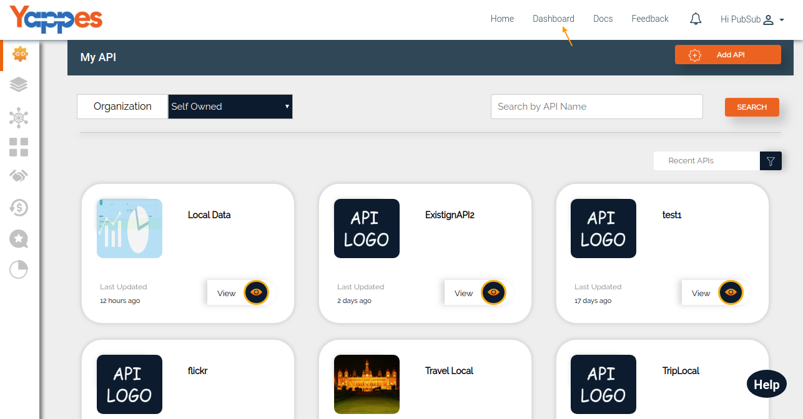

API Usage - Consumer
====================

Yappes allows the API Usage to be tracked for the Consumers as well. API
Usage can be tracked under Applications in which the APIs are used.

1.  To get this details click on dashboard from the top menu. This will
    render the Dashboard view.

    

2.  Under Dashboard there is a sub tab called **Application** Click on
    this, which will list your applications.

    

3.  Each Application can be viewed by clicking **View** button and under
    this tab we can see **Usage**Tab. Here Consumers can get the usage
    of their APIs in only one Metric Level.i.e API Level.

    

4.  Next , We will go through API Analytics for Consumer in detail

    [**Next : API Level - Consumers**](analytics_consumer_apilevel.md)
