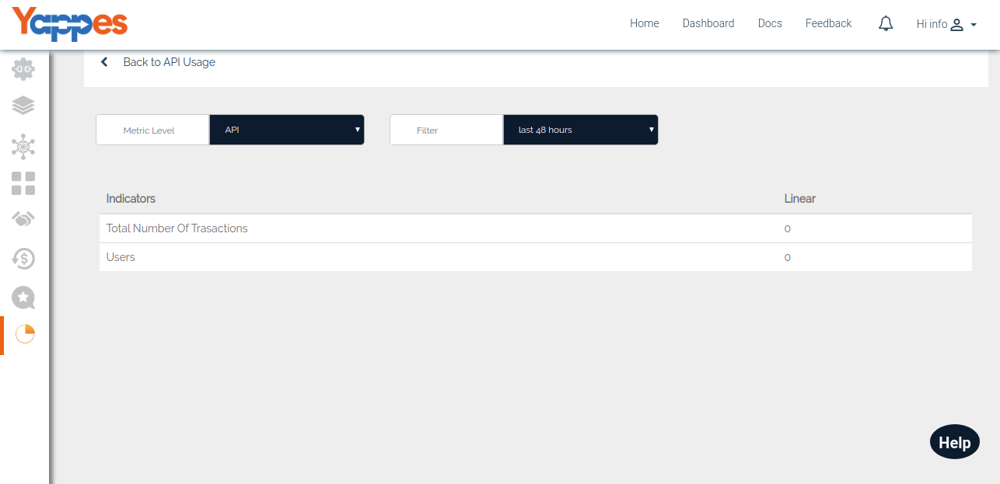

API Usage - API Level
=====================

Here the Provider can see what is the total number of transactions and
number users of this API.

-   Provider can also filter the result with the following options.
    -   Last 48 hours
    -   Last 30 days
    -   Last 90 days
    -   Custom Range
-   With a Filter set to "Custom", you can check the API Usage between
    different date ranges.

    

-   Next , We will see API usage - Endpoint Level

[**Next : Endpoint
    Level**](analytics_endpoint_level.md)
