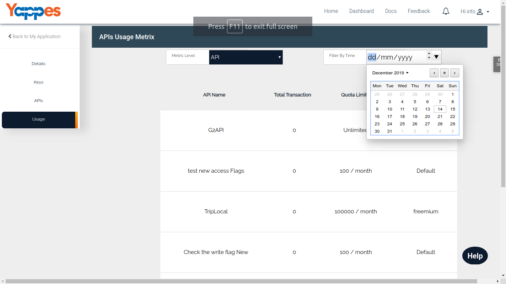

API Level - Consumers
=====================

As a Consumer, Usage of API can be tracked in one metric level i.e API
Level.

-   It will give you the following details.
    -   API Name
    -   Total Transactions
    -   Quota Limit - Active Quota subscribed by the user
    -   Pricing Type - Active Pricing plan subscribed by the user
-   You can also filter the result with the following options.
    -   Last 48 hours
    -   Last 30 days
    -   Last 90 days
    -   Custom Range
-   With a Filter set to "Custom", you can check the API Usage between
    different date ranges.

    
