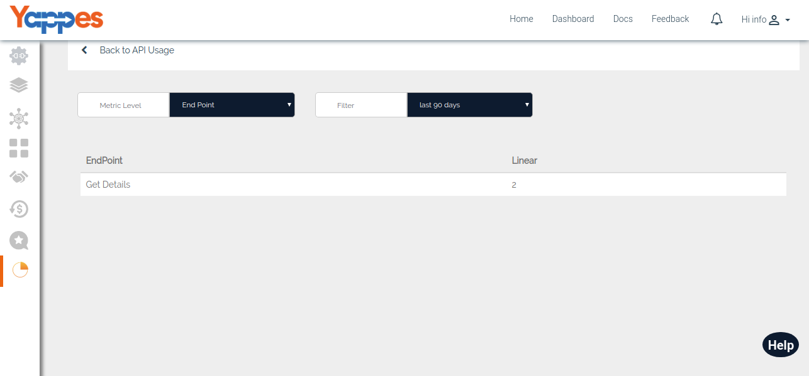
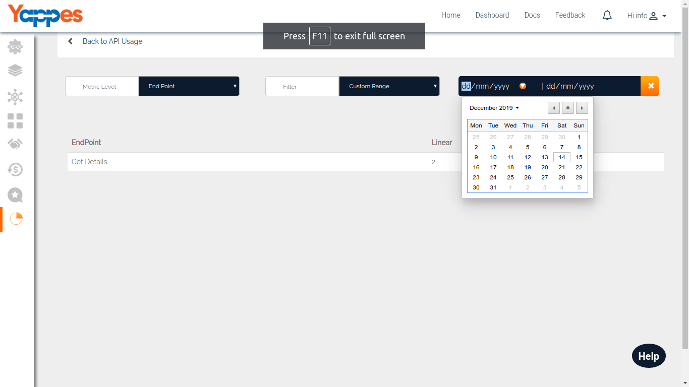

API Usage - Endpoint Level
==========================

Usage of the API based on the Endpoint will be displayed in this
section.

-   It will give the list of endpoints that is been consumed by others
    and number of total usage.
-   Provider can also filter the result with the following options.
    -   Last 48 hours
    -   Last 30 days
    -   Last 90 days
    -   Custom Range
-   With a Filter set to "Custom", you can check the API Usage between
    different date ranges.

    

-   Next , We will see API usage - User Level

[**Next : User
    Level**](analytics_user_level.md)
