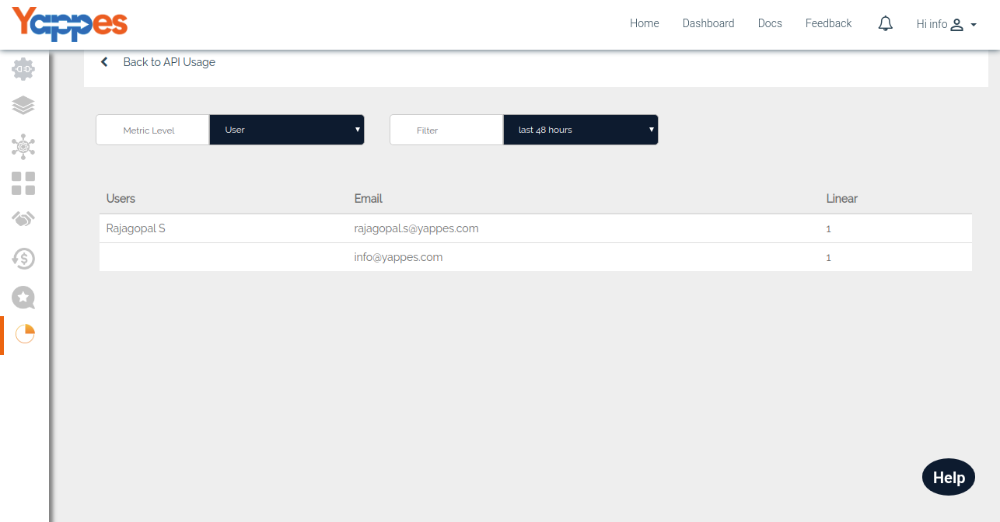
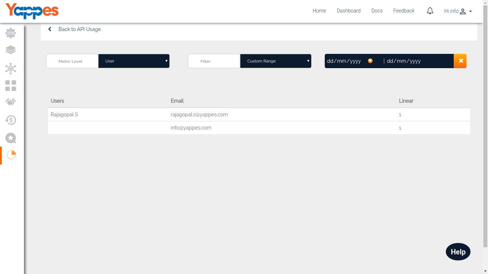

API Usage - User Level
======================

If you select the metric level as "User" then it will give you the usage
of your API with respect the users who have tried or subscribed to the
API.

-   It will give you the following details.
    -   User name
    -   Email
    -   Total number of transactions per user
-   Provider can also filter the result with the following options.
    -   Last 48 hours
    -   Last 30 days
    -   Last 90 days
    -   Custom Range
-   With a Filter set to "Custom", you can check the API Usage between
    different date ranges.

    

-   Next , We will see API usage - Consumers 
[Next : API Analytics - Consumers](APIAnalytics_consumers.md)
