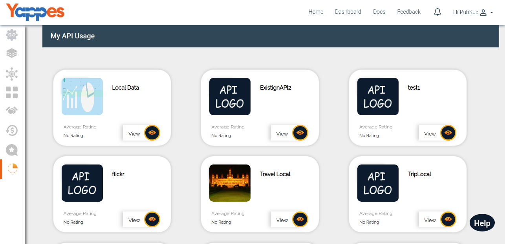
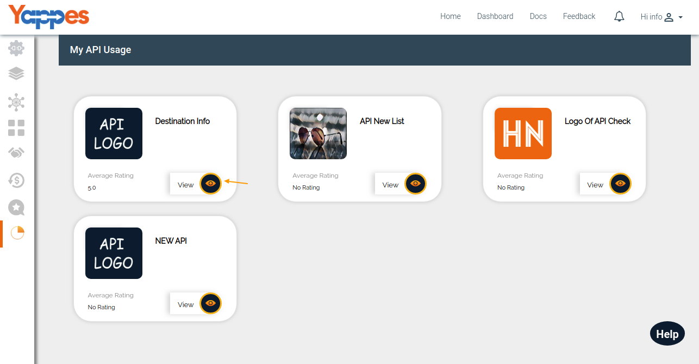
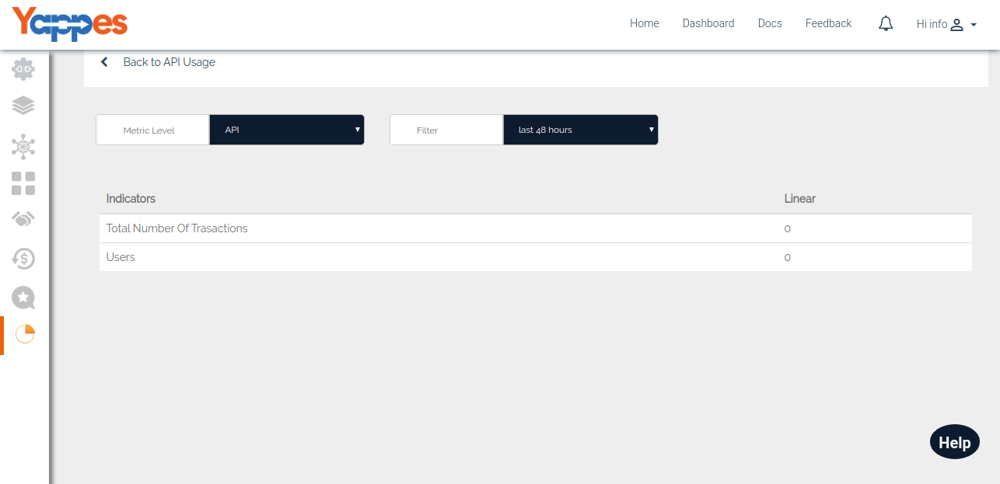

API Usage - Provider
====================

Yappes allows the User(API Provider) to know the Usage of their APIs
under different Metric Levels. The Usage details will be available for
the APIs which are published and subscribed APIs.

Currently Yappes provides three types of Metric levels

-   API Level
-   Endpoint Level
-   User Level

1.  Click on **API Usage** under Dashboard .

    

2.  All your published APIs will be displayed once you clicked it and
    Click on the **View** button to see the API Usage.

    

3.  Once you click the **View** button , usage of your API under
    different Metric level will be shown and default will be API Level.

    

4.  Next , We will go through each metric level in detail ["Next : API
    Level"](analytics_api_level)
