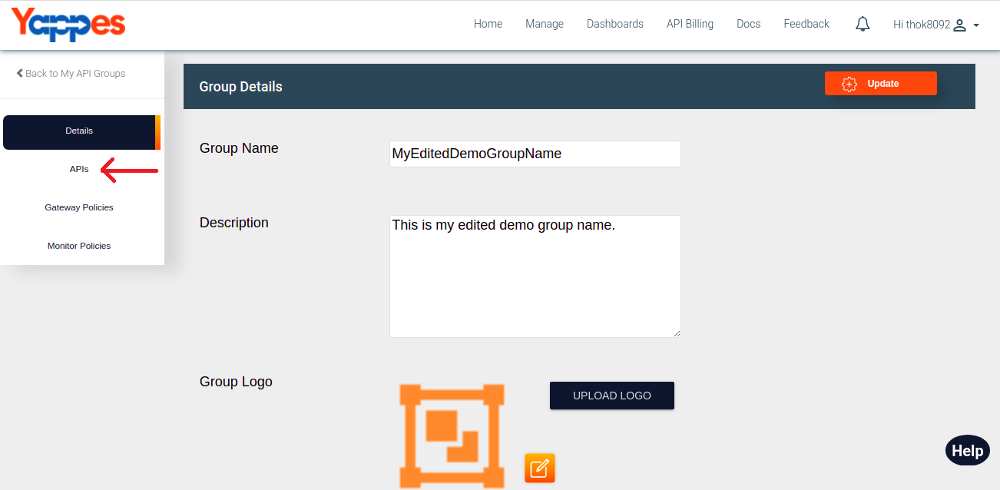
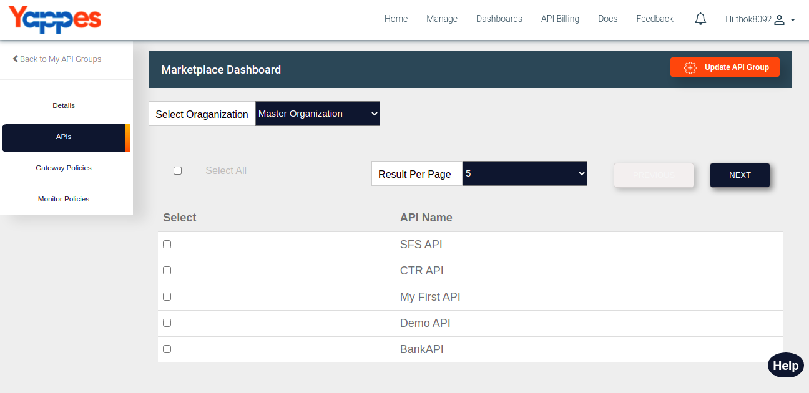
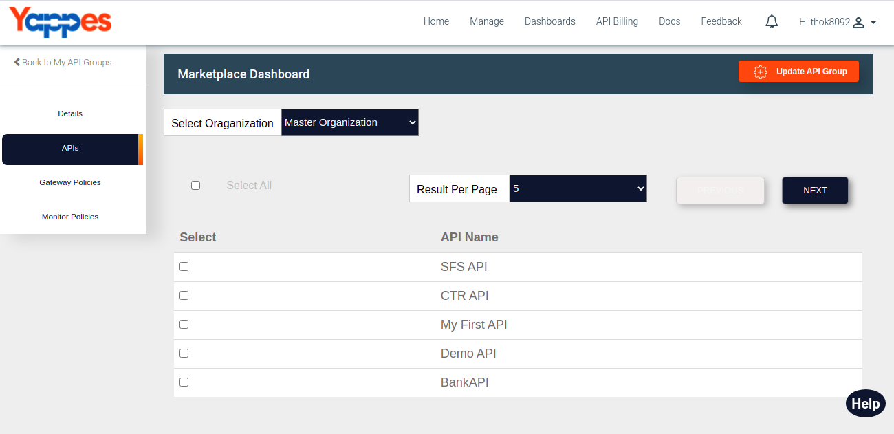
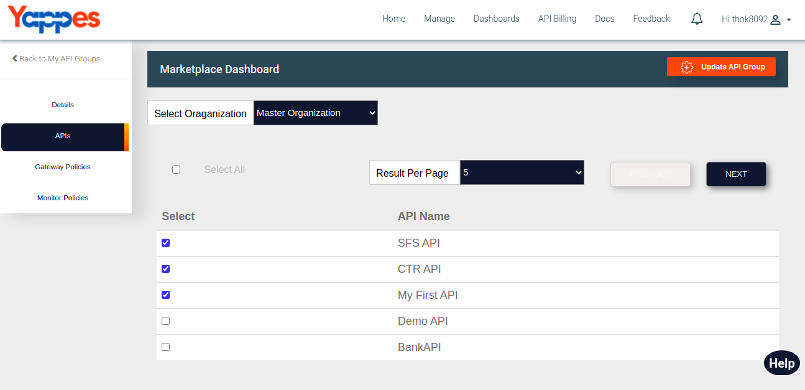

Add Remove APIs
================

Under this section, we will see in detail, how to Add and Remove API's.

To start with this, we need to navigate to **API's** tab.

-   Click on API's tab.
    
-   User will see all the API's associated with particular organization.
-   User can select organization name from dropdown menu to get the list
    of all the API's associated with that organization.
        
-   To add API's in a group, select the check box of API which you want
    to add in a group and click on Update API Group button.
        
-   User will see added API's in the group with check box selected.
    
-   To remove API's from the group, unselect the checkbox and click on
    Update API Group button.
        
-   User will see updated selected API's in the group.
    

Next we will see in detail about Add/Remove Gateway Policies 

[**Next :
Add/Remove Gateway Policies**](add_remove_gateway_policy.md)
