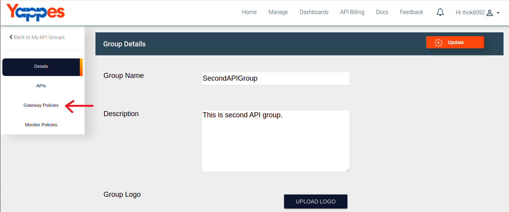
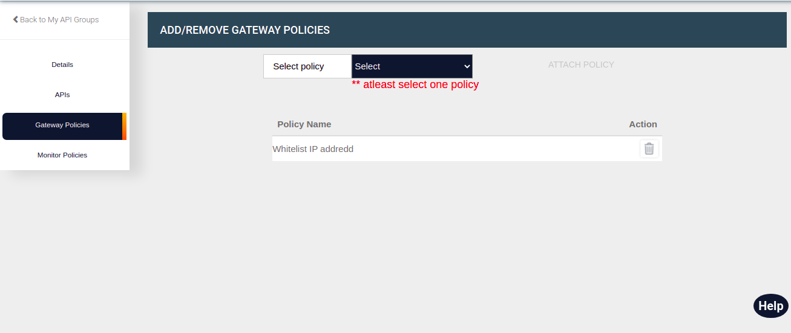
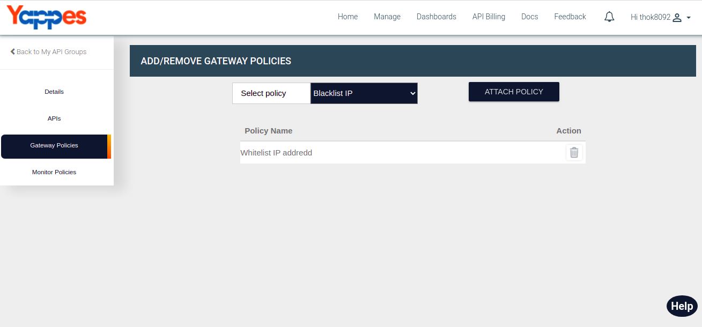
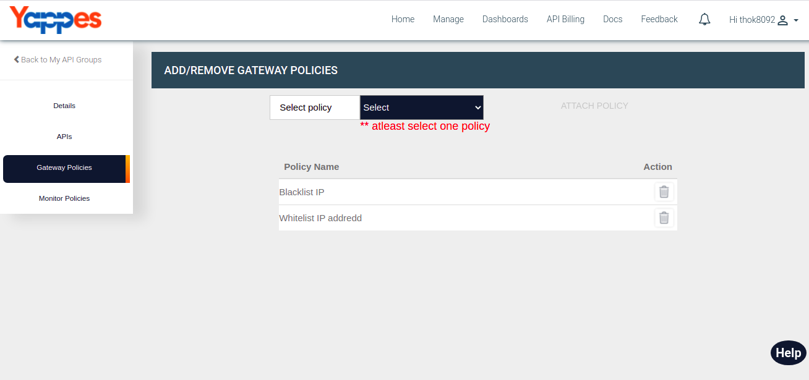
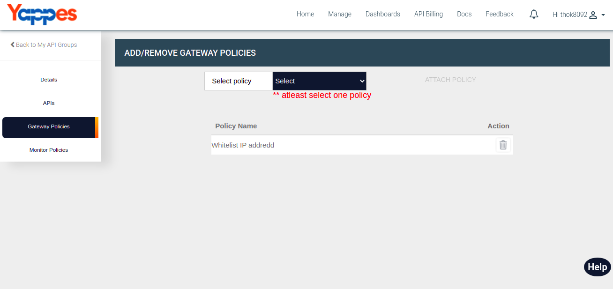

Add/Remove Gateway Policies
===========================

Under this section, we will see in detail, how to Add and Remove Gateway
Policies.

To start with this, we need to navigate to **Gateway Policies** tab.

-   Click on Gateway Policies tab.
    
-   User will see the list of all the Gateway Policies which are added.
    
-   To add new Gateway Policy, Select the policy from the dropdown menu
    and click on ATTACH POLICY button.
        
-   User will see attached gateway policy in the list.
    
-   To remove attached gateway policy, Click on delete button icon.
    
-   User will see updated gateway policy list.
    

Next we will see in detail about Add/Remove Monitor Policies ["Next :
Add/Remove Monitor Policies"](add_remove_monitor_policy.md)
