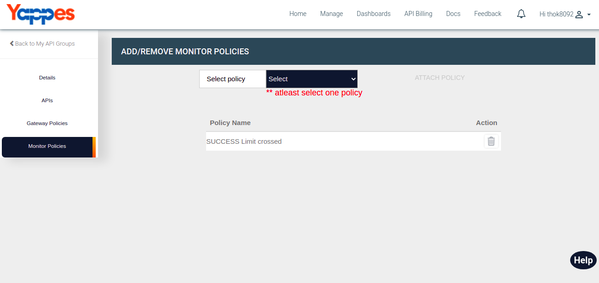

Add/Remove Monitor Policies
===========================

Under this section, we will see in detail, how to Add and Remove Monitor
Policies.

To start with this, we need to navigate to **Monitor Policies** tab.

-   Click on Monitor Policies tab.
    
-   User will see the list of all the Monitor Policies which are added.
    
-   To add new Monitor Policy, Select the policy from the dropdown menu
    and click on ATTACH POLICY button.
        
-   User will see attached monitor policy in the list.
    
-   To remove attached monitor policy, Click on delete button icon.
    
-   User will see updated monitor policy list.
    

Next we will see the how to reach us for any doubts in the documentation
or in the tool [Need Help?](../reach_us.md)
