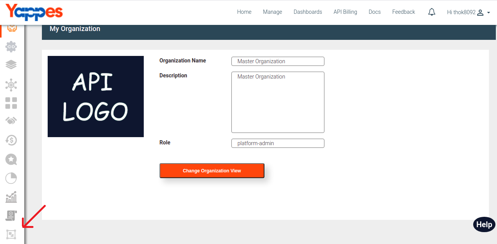
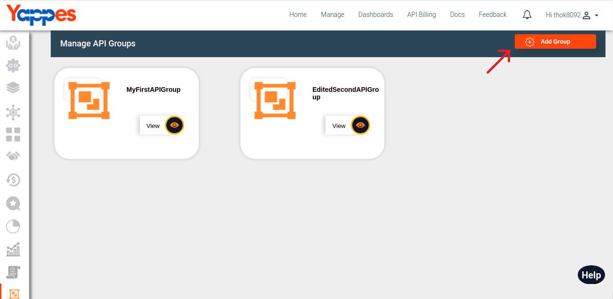
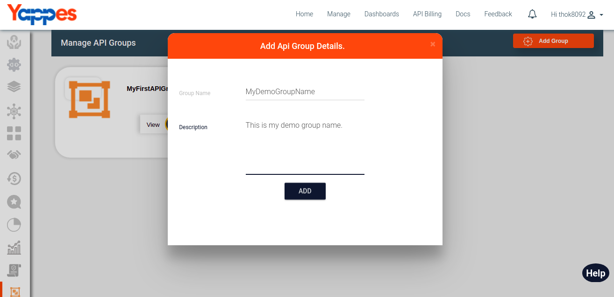
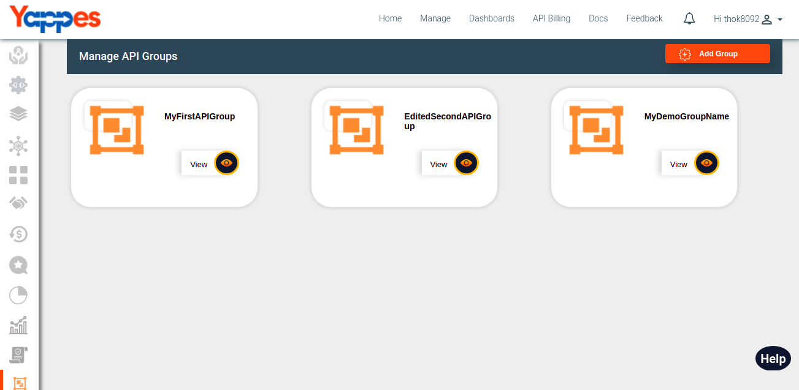
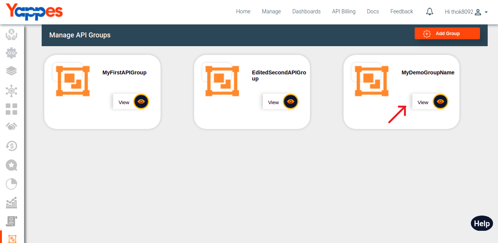
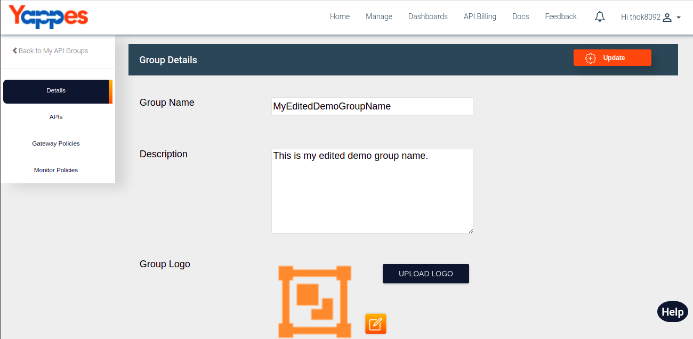
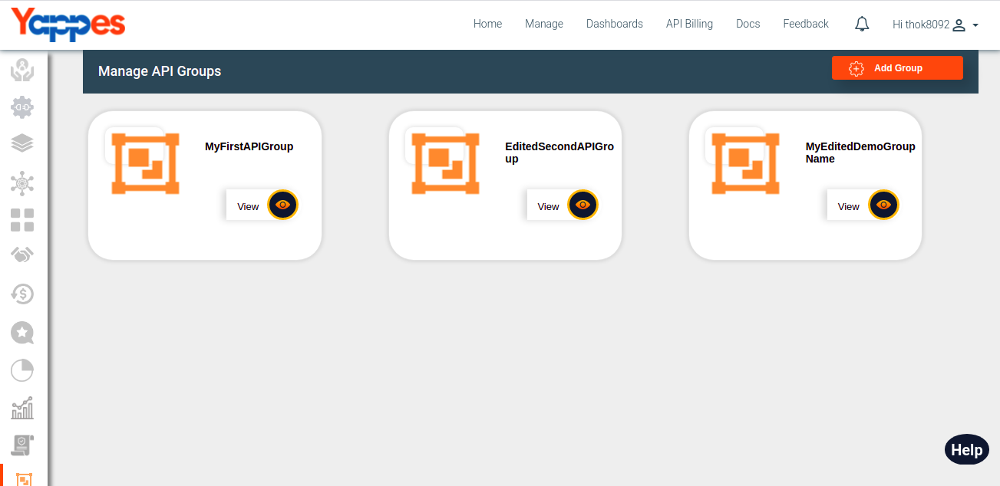

Create Edit API Groups
======================

Under this section, we will see in detail, how to Create Edit API
Groups.

To start with this, we need to navigate to **API Groups** tab.

-   Click on API Groups tab.
    
-   User will see cards of all the API groups.
    
-   To create a new API Group click on Add Group button.
    
-   Fill the API Group name and Description and click on ADD button.
    
-   User will see API groups cards.
    
-   To edit API group, click on view button on the API group card.
    
-   User can edit API group name and Description. After edit click on
    Update button.
        
-   User will see updated API group name on API Group card.
    

Next we will see in detail about Add/Remove API's ["Next : Add/Remove
API's"](add_remove_apis.md)
