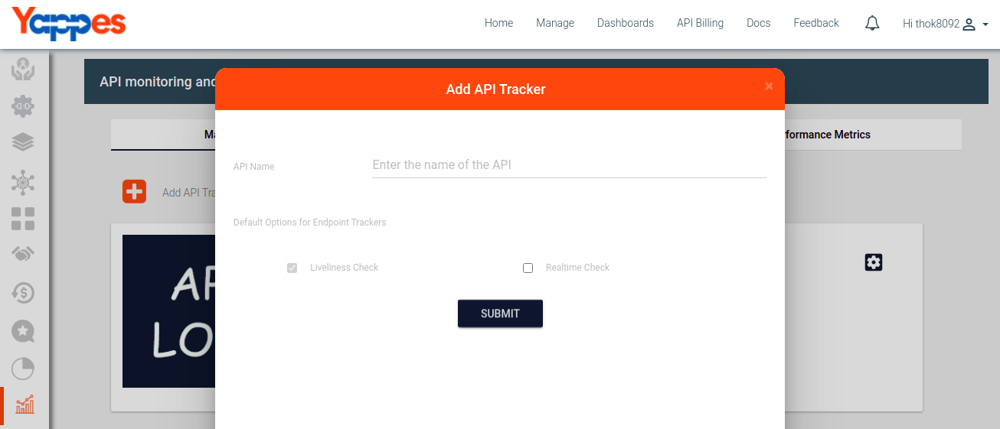
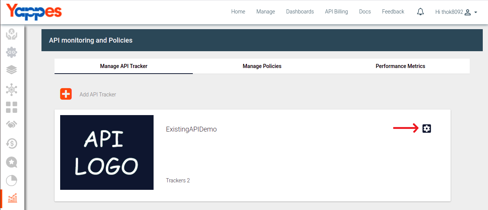

Add/Update End Point Trackers
=============================

Under this section, we will see in detail, how to Add/Update End point
trackers

To start with this, we need to navigate to **trackers** tab.

-   Click on the Manage API Trackers Tab
    
-   Click on the Add API tracker button.
    
-   User will notice an Add tracker popup. Fill in the form and click on
    submit.
        
-   Then user will see API card where setting/update button will be
    available.Where user can select the endpoint.
     
        
-   User can see status of the endpoint and configuration section.
            
-   Click on Configration section to update the tracker details or
    attach policies to the tracker.
        

Next we will see in detail about viewing the chart of an API ["Next :
View charts"](view_charts)
