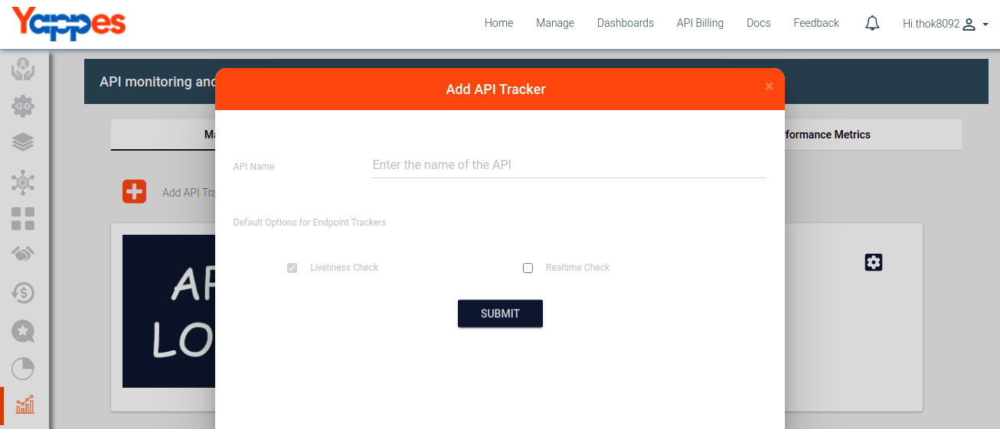

Add/Update API Monitoring Policies
==================================

Under this section, we will see in detail, how to Add/Update policies

To start with this, we need to navigate to **Manage policies** tab.

-   Click on the Add policy
		 
-   Fill the form about polices that we can attach to trackers.
		 
-   User will see added policies.
		 

Next we will see in detail about Attach API Monitoring Policies ["Next :
Attach API Monitoring Policies"](attach_policies_tracker)
