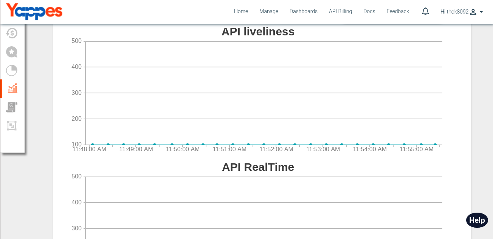
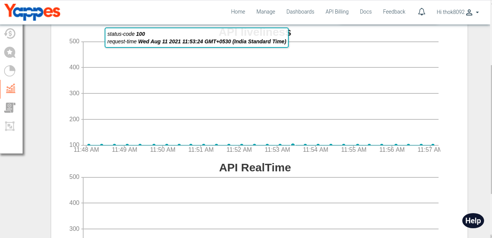

View Monitoring Charts
======================

Under this section, we will see in detail, how API Monitoring Chart
works

To start with this, we need to navigate to **trackers** tab.

-   Click on the Manage API Trackers Tab
     
-   Click on the settings button on the api card and select the
    endpoint.
         
-   User will notice 2 graphs.
     
-   User can get more details about the API call by hovering over the
    data points in the chart.
         

Next we will see in detail about API Monitoring Policies 

[**Next : API
Monitoring Policies **](api_monitoring_policies.md)
