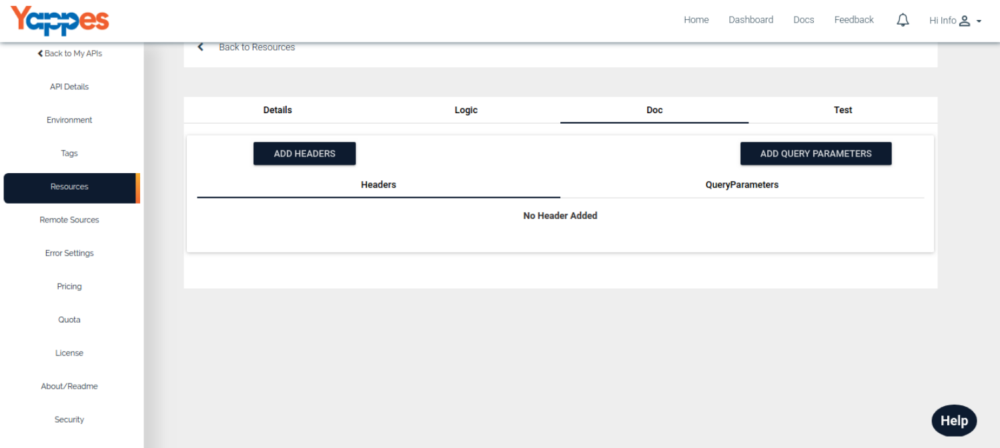

Documentation
=============

In this part, User can add **Headers**, **Query Parameters** and **Form
Data**(if POST) to a particular endpoint.

To handle documentation, user must first open the documentation view of
the endpoint.

1.  Click on the **Edit** button of a particular endpoint. This by
    default, will render a view consisting existing endpoint details.
2.  Now, from the sub-menu, click on **Doc** button. This will render
    the Documentation view.
3.  On Doc button click, you will see options to add Documentations.
    

**Adding Header Parameters**

1.  To get started with adding Headers, click on **Add Headers** button.
2.  On **Add header** click,a dialog opens up prompting the details about
    the header.
    1.  Name - A valid name of the header which will be associated with
        the endpoint.
    2.  Value - Value of the header.You can edit it after when you need
        a change.
    3.  Type - Type of the header.You can choose accordingly.
        -   String - Select it if the header value is a String.
        -   Number - Select it if the header value is a Number.
        -   Boolean - Select it if the header value is a Boolean.
    4.  Options - This field tells the user that the header is mandatory
        or optional.
        -   Optional - Choose this option if this header is optional.
        -   Mandatory - Choose this option if this header is compulsory.
    5.  Descriptions - Detailed information about the header.
3.  Click on **Add** button once you have entered all the fields.
4.  Header details will be displayed on the main view of Doc.

------------------------------------------------------------------------

**Adding kQuery Parameters**

1.  To add Query Parameters, click on **Add Query Parameters** button.
2.  On **Add Query Parameter** button click, a dialog opens up, prompting
    the details of the query parameter.
    1.  Name - A valid name of the query parameter which will be
        associated with the endpoint.
    2.  Value - Value of the query parameter.You can edit it after when
        you need a change.
    3.  Type - Type of the query parameter.You can choose accordingly.
        -   String - Select it if the query parameter value is a String.
        -   Number - Select it if the query parameter value is a Number.
        -   Boolean - Select it if the query parameter value is a
            Boolean.
    4.  Options - This field tells the user that the query parameter is
        mandatory or optional.
        -   Optional - Choose this option if this query parameter is
            optional.
        -   Mandatory - Choose this option if this query parameter is
            compulsory.
    5.  Descriptions - Enter detailed description about the query
        parameter.
3.  Click on **Add** button once you have entered all the details
4.  Query Parameter details will be displayed on the main view of Doc.

**Adding From Data**

1.  To add Form Data, click on **Add Form Data** button.
2.  On **Add Form Data** button click, a dialog opens up, prompting the
    details about the Form Data.
    1.  Type - Type of the Form data. You can choose accordingly.
        -   String - Select it if the Form data value is a String.
        -   Number - Select it if the Form data value is a Number.
        -   Boolean - Select it if the Form data value is a Boolean.
        -   Modal - Select it if the Form data value is a raw JOSN data.
    2.  Options - This field tells the user that the Form data is
        mandatory or optional.
        -   Optional - Choose this option if this Form data is optional.
        -   Mandatory - Choose this option if this Form data is
            compulsory.
    3.  Name - A valid name of the Form data which will be associated
        with the endpoint.
    4.  Value - Value of the Form data.You can edit it after when you
        need a change.
    5.  Descriptions - Enter detailed description about the Form Data.
3.  Click on **"Add"** button once you have entered all the fields.
4.  Form Data details will be displayed on the main view of Doc.

In the next section, we will see about Testing Endpoints [**Next :
Testing Endpoints**](testing_endpoint.md)
