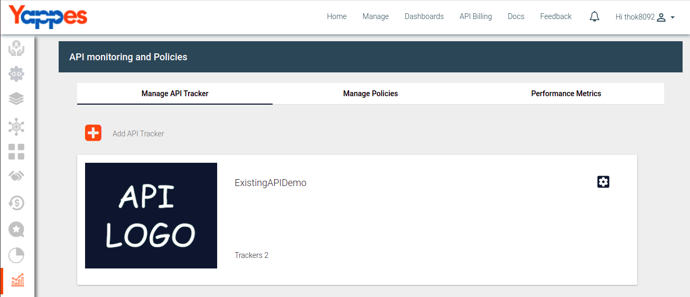
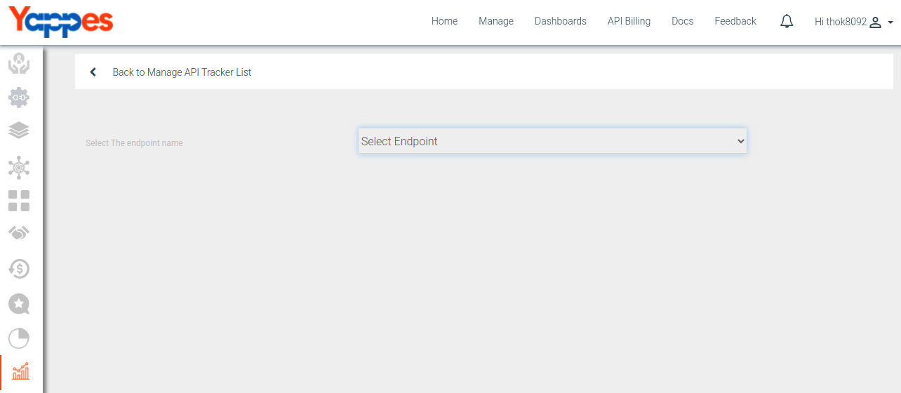
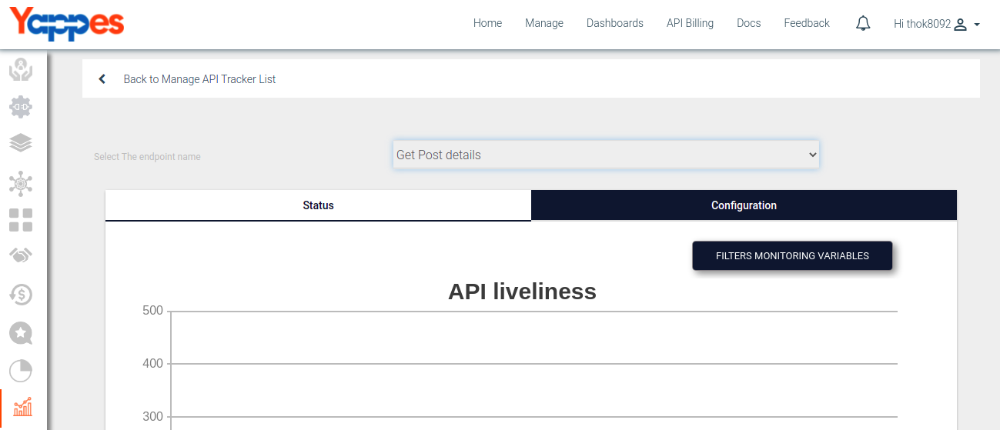
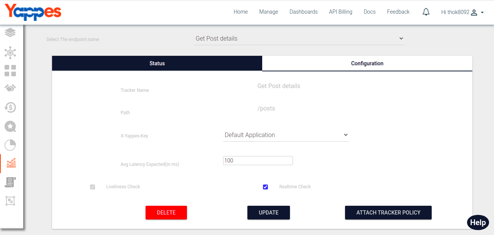

Analytics Dashboard
===================

Under this section, we will see in detail, how to view charts of
Analytics Dashboard.

To start with this, we need to navigate to **Analytics** tab.

-   Click on Analytics tab.
     
-   User will see detailed analysis of Analytics Dashboard within
    specified time period.
-   Change time period dropdown menu and click on GET STATISTICS button
    to view Analytics.
-   User can select time period:
    1.  Last 15 days
    2.  Last 1 month
    3.  Last 2 months
         
-   User will see traffic metric, Top 10 API's with respect traffic and
    Traffic status metric.
     
         

Next we will see in detail about Manage API Groups ["Next : Manage API
Groups"](../APIGroups/api_groups.md)
