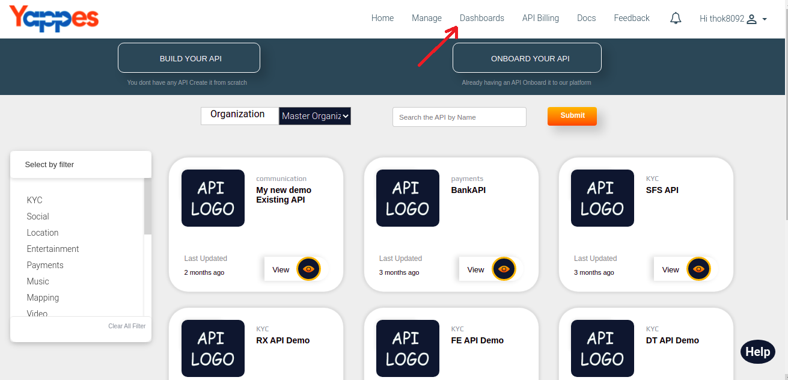

Marketplace Dashboard
=====================

Under this section, we will see in detail, how to view charts of
Marketplace Dashboard.

To start with this, we need to navigate to **Dashboards** tab.

-   Click on Dashboards tab.
     
-   User will see column chart of Marketplace API's.
-   User can get exact count of the API's by hovering over the columns
    in the chart.
         
-   Change chart types drpodown menu to change the view of the chart of
    the API's.
-   User can select chart types:
    1.  Column chart
    2.  Pie chart
    3.  Bar chart
     
         
-   Change key performance indicators drpodown menu as Subscriptions to
    view the charts of Marketplace Subscriptions.
         
-   Change chart types drpodown menu to change the view of the chart of
    Subscriptions.
-   User can select chart types:
    1.  Column chart
    2.  Pie chart
    3.  Bar chart
     
         
-   Change key performance indicators drpodown menu as Transactions to
    view the charts of Marketplace Transactions.
          
-   Change chart types dropdown menu and time period dropdown menu and
    click on GET STATISTICS button to view charts with that time period.
-   Cser can select chart types:
    1.  Column chart
    2.  Pie chart
    3.  Bar chart
     
         

Next we will see in detail about Organization Dashboard 

[**Next :
Organization Dashboard**](organization_dashboard.md)
