Organization Dashboard
======================

Under this section, we will see in detail, how to view charts of
Organization Dashboard.

To start with this, we need to navigate to **Organization** tab.

-   Click on Organization tab.
    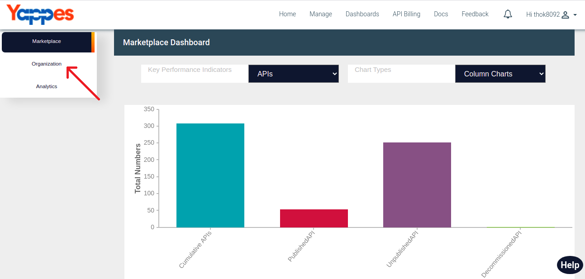 
-   User will see column chart of organization key performance
    indicator.
-   User can get exact count of the organizations by hovering over the
    columns in the chart.
    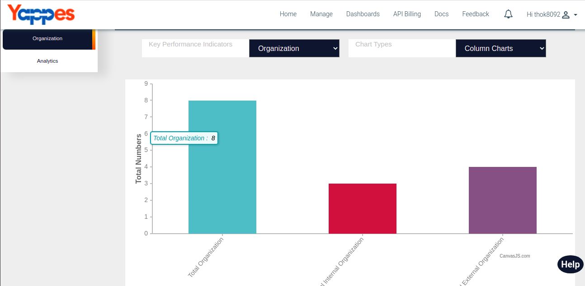     
-   Change chart types drpodown menu to change the view of the chart of
    the organization.
-   User can select chart types:
    1.  Column chart
    2.  Pie chart
    3.  Bar chart
    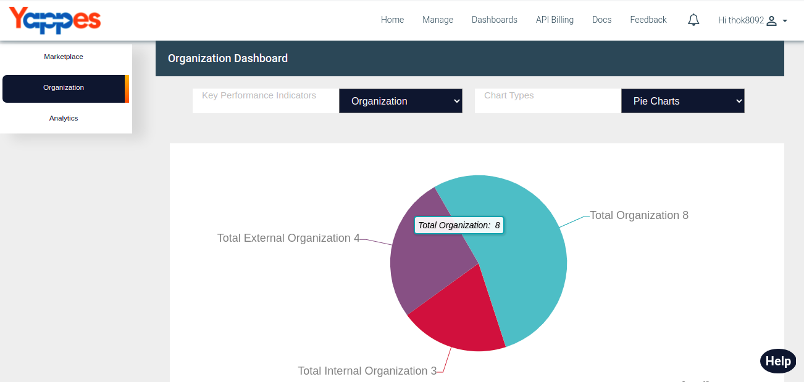 
    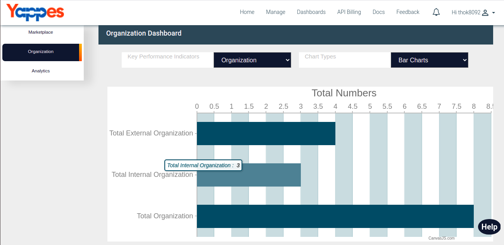     
-   Change key performance indicators drpodown menu as Users to view the
    metrics of Organization Users.
-   User will see all the users, active users and inactive users of all
    the organizations.
    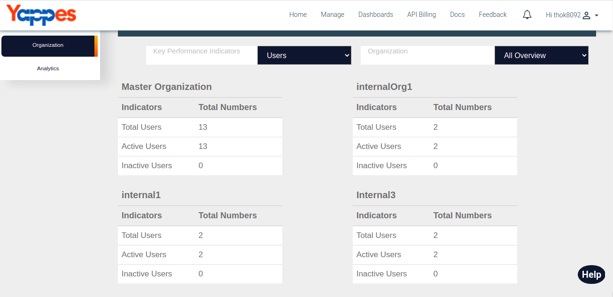     
-   Change organization dropdown menu to view users charts of the
    particular organization.
-   User will see column chart for Users of that particular
    organization.
-   User can get exact count of the users of that particular
    organization by hovering over the columns in the chart.
    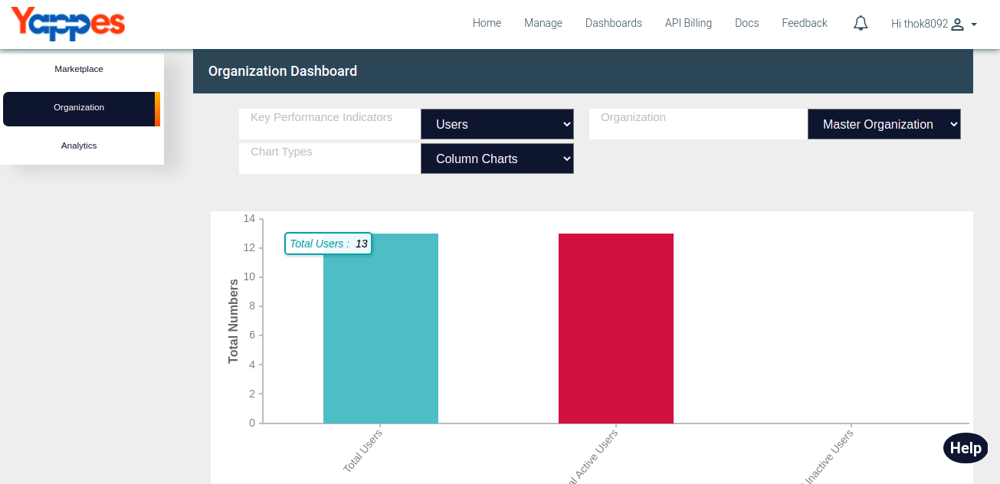     
-   Change chart types drpodown menu to change the view of the chart of
    the users of that particular organization.
-   User can select chart types:
    1.  Column chart
    2.  Pie chart
    3.  Bar chart
    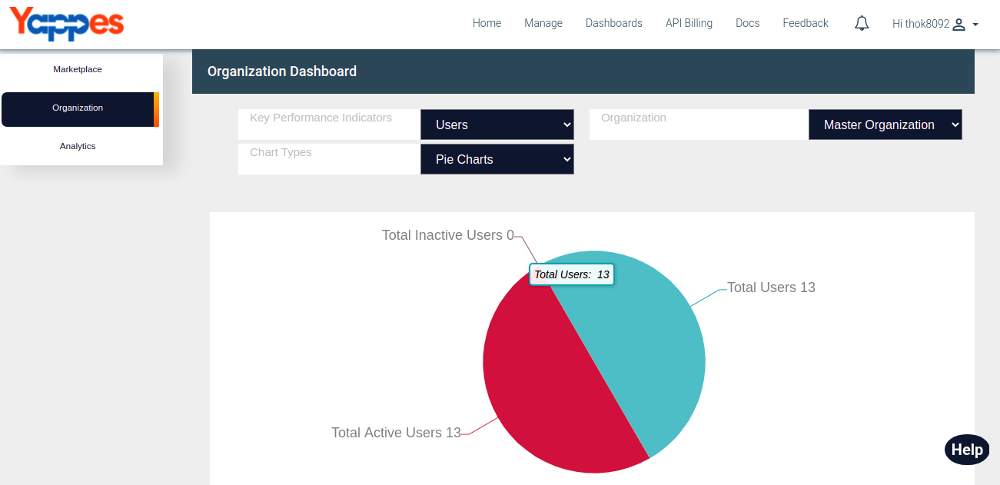 
    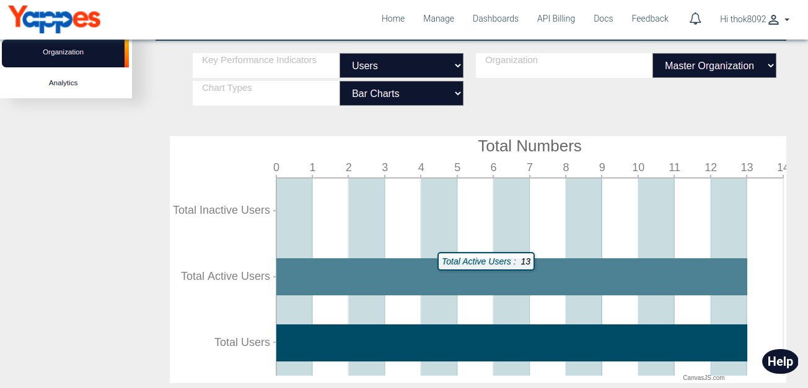     
-   Change key performance indicators drpodown menu as API to view the
    metrics of Organization API.
-   User will see all the API's, Published, Unpublished and
    Decommissioned APIs of all the organizations.
    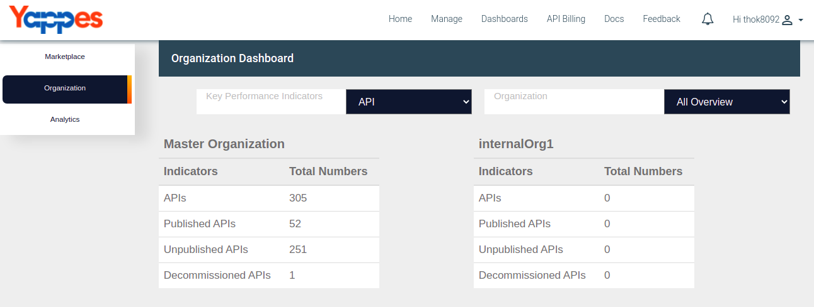     
-   Change organization dropdown menu to view API charts of the
    particular organization.
-   User will see column chart for API of that particular organization.
-   User can get exact count of the API's of that particular
    organization by hovering over the columns in the chart.
    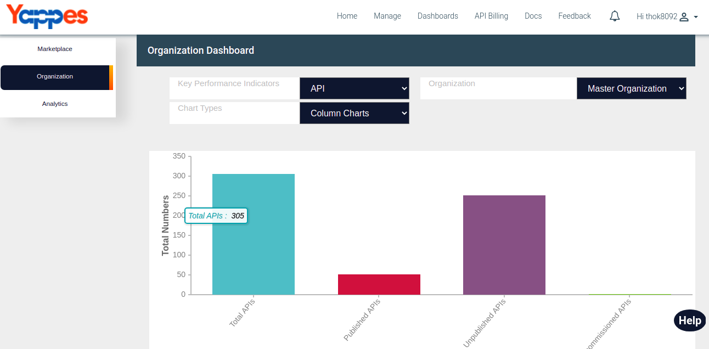     
-   Change chart types drpodown menu to change the view of the API chart
    of that particular organization.
-   User can select chart types:
    1.  Column chart
    2.  Pie chart
    3.  Bar chart
    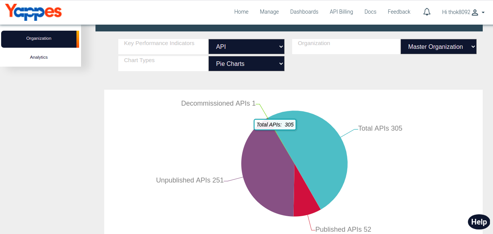 
    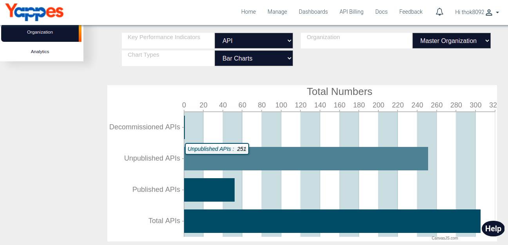 

Next we will see in detail about Analytics Dashboard ["Next : Analytics
Dashboard"](analytics_dashboard.md)
