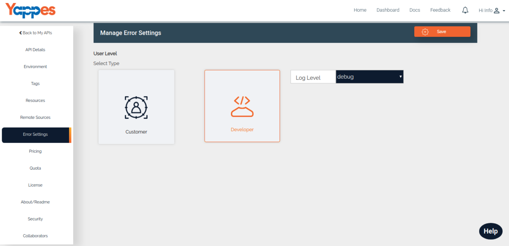
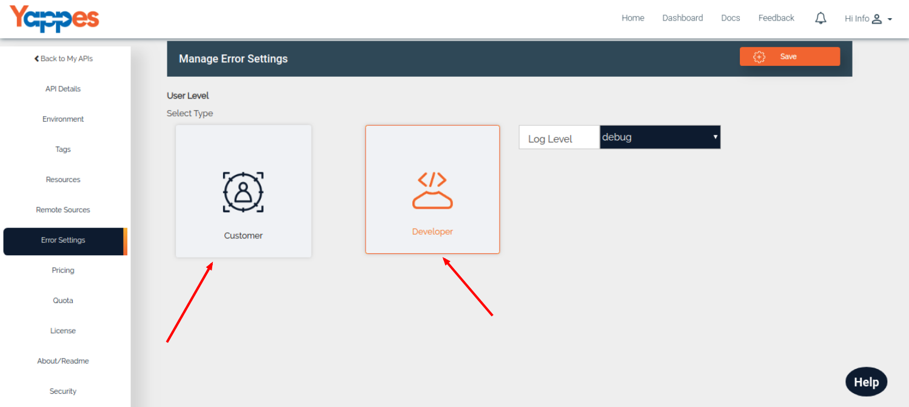

Error Settings
==============

Yappes provides the facility to customize error messages that will be
delivered from the server on custom logic execution error conditions. 

This can be acheived by configuring the error settings

To get started, click on **Error Settings** in the left navigation panel.

Error settings requires 2 configurations.

1.  User level configuration - Setup the receiver (Customer or
    Developer)
2.  Log level configuration - Setup the log level (Debug, Error or Info)

Next : We will further see how to configure [error
settings.](configure_error_settings.md)
