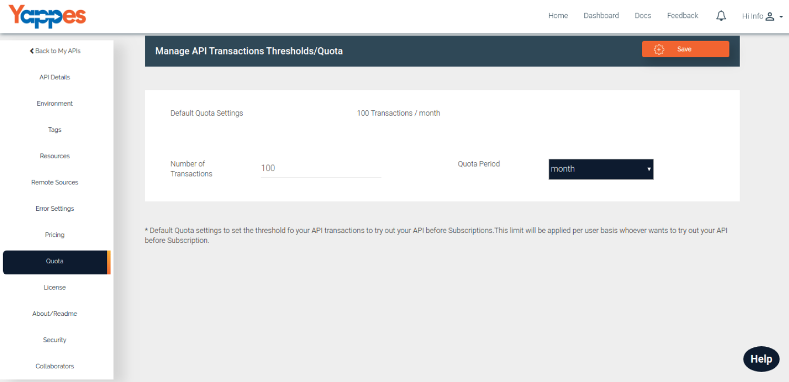

Quota
=====

Quota settings are used to the specify the transactions the consumers can try out 
before they subscribe to your API.

By Default the number of transaction enabled will be 100 / month
whenever the API is created.

API Provider can update

-   Number of Transactions.

-   Quota Period - Period is either month wise or day wise.

Next we will see the API Terms and Conditions. [**Next : API Terms
    and Conditions**](license_new.md)
