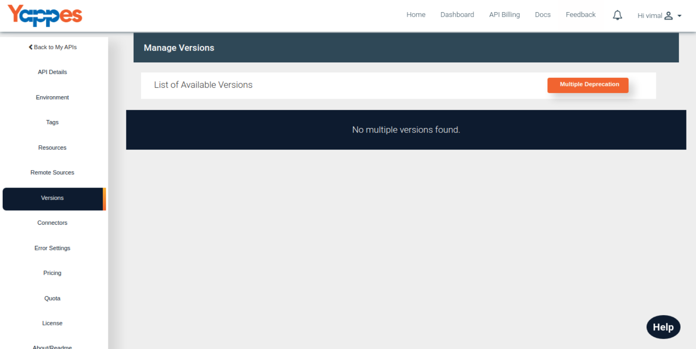
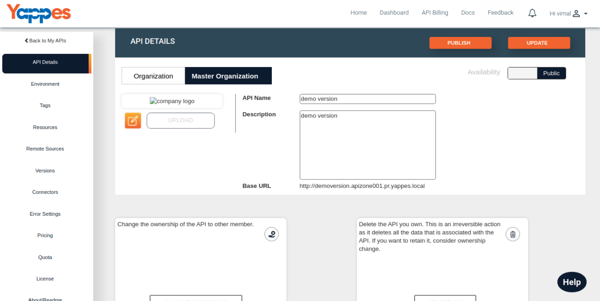
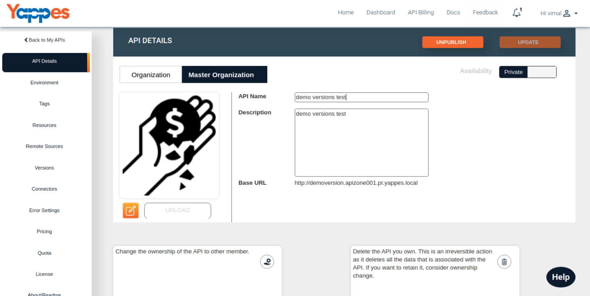
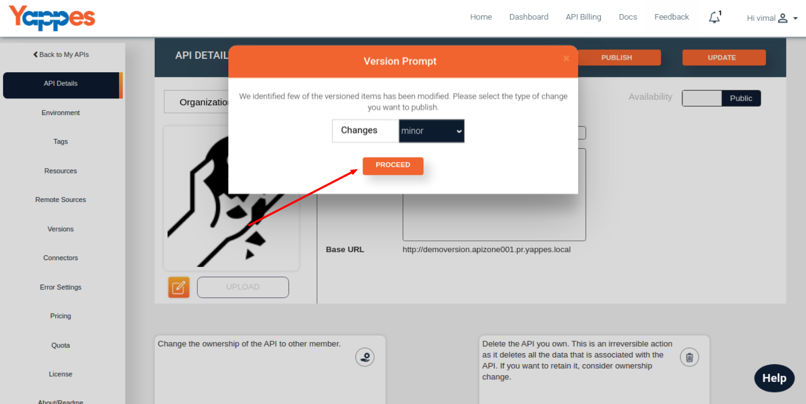

Create New API Version
======================

Under this section, we will see in detail, how to version the API

To start with this, we need to navigate to **Versions** tab.

-   Click on the Versions Tab
    
-   Initially only empty version list will be visible, as versions are
    not created yet.Versions will be created at the time of publishing
    the API.
    
-   Complete the basic API design as described in our previous sections.
    
-   And while publishing, if the system identifies any API design level
    changes it will automatically prompt for versioning.Depending upon
    the changes, the version levels(patch, minor, and major) will be
    selected and applied.
        

Next we will see in detail about viewing the single version of an API

[**Next : View Single Version**](view_versions.md)
