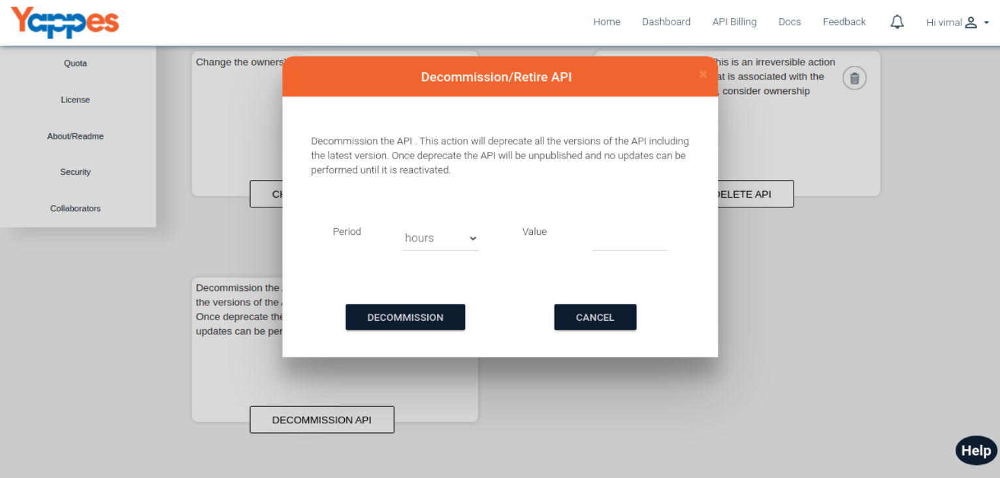

Decommissioning The API
=======================

Yappes provides the ability for the users to completely decommission as
API from usage.

1.  In the API details tab, Decommission API option will be available
    for the user.
    
2.  once you click the Decommission API, it will open up the pop-up
    modal to get additionla information about the process.
        
3.  From the Pop up you can give period as Hours, Day or Week. This data
    tells the platform to start decommission process after the provided
    period.
        
4.  After If you click Decommission Button it will decommission the API
    for the given period and then Reactivate API option will be enabled.
        
5.  If you click on the Reactivate API option, then confirmation dialog
    will be propmted with yes or no options. If you click "yes", then
    the API will be reactivated.
        
6.  Once the reactivation is done, Decommission API option will be
    availble for the user.
    

Next we will see the API Monitoring. [API Monitoring](APIMonitoring)
