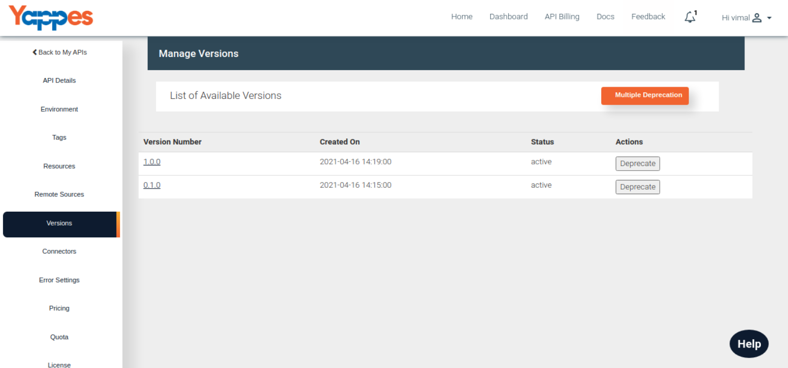
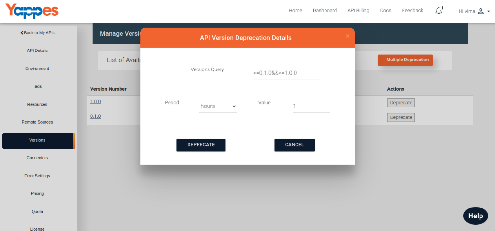
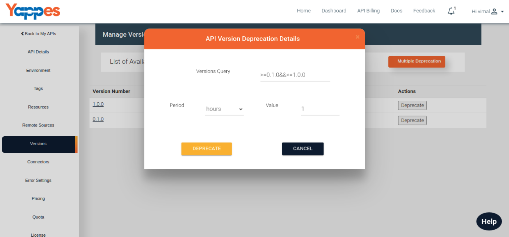
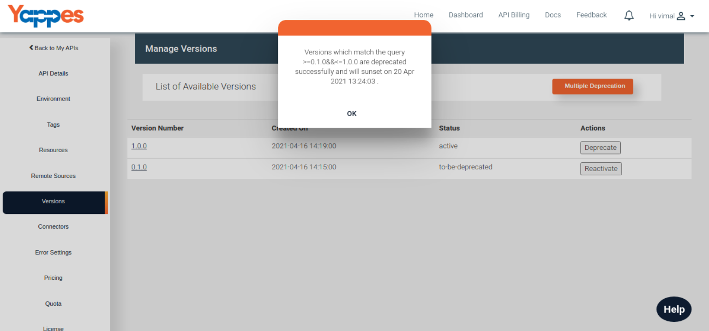
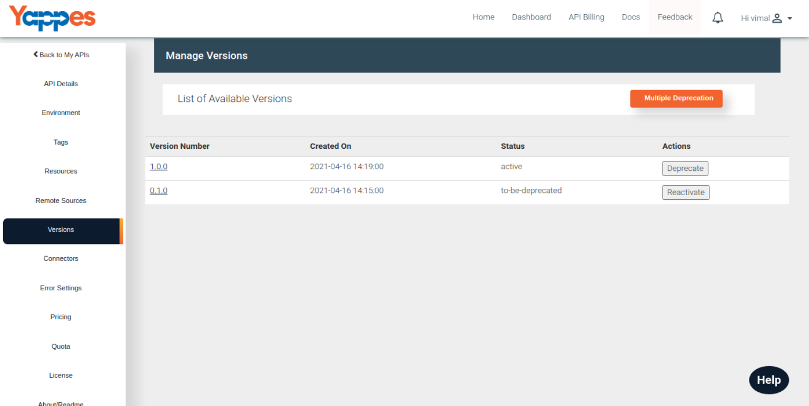

Deprecate Multiple Version
==========================

1.  Multiple API versions can be deprecated from a single set of
    actions. Yappes platform provides depracate queries using which the
    bulk deprecation can be done. The queries are the combinations of
    logical operators (&&,&gt;,&lt;,=) and version numbers in semver
    format (x.y.z).
    
2.  Under Version tab, once the "Multiple Deprecation" button is
    clicked, it will prompt for the deprecation details.
    
3.  In the query window, it will support versions Query like following,
    
4.  Through this, you can deprecate multiple versions directly. For
    example already having the version like 1.0.0 and 0.1.0 If you want
    deprecate you can use the following ternary expressions
    ex: &gt;=0.1.0&& &lt;=1.0.0
    
5.  After clicking Deprecate button, if the query versions are proper
    then proper valid response will be displayed.
    
6.  All the versions can be deactivated based on the Query that is
    given. NOTE: Latest version cannot be deprecated until the API is
    fully decommissioned.
    

Next we will see in detail about viewing Decommissioning the API ["Next
: Decommissioning"](decommissioning)
