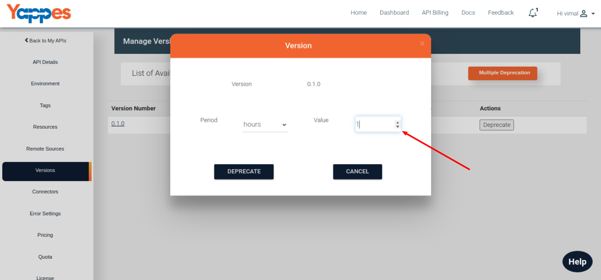
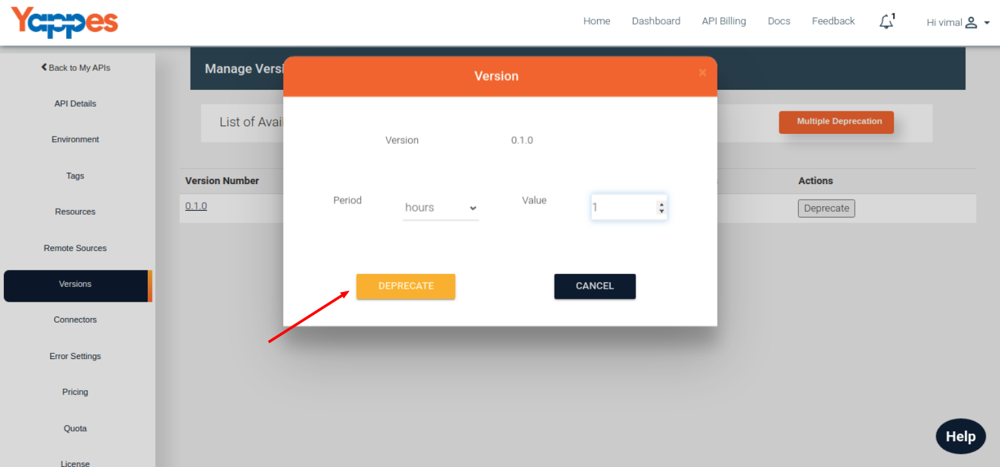
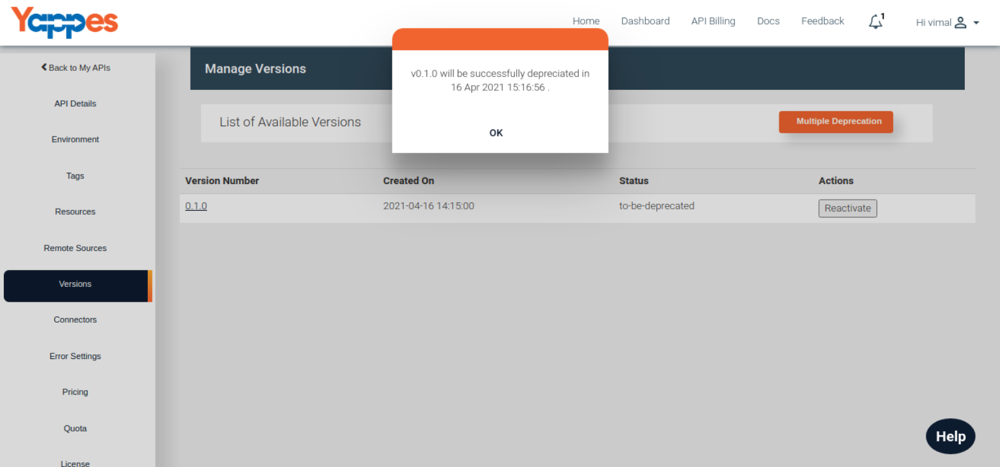
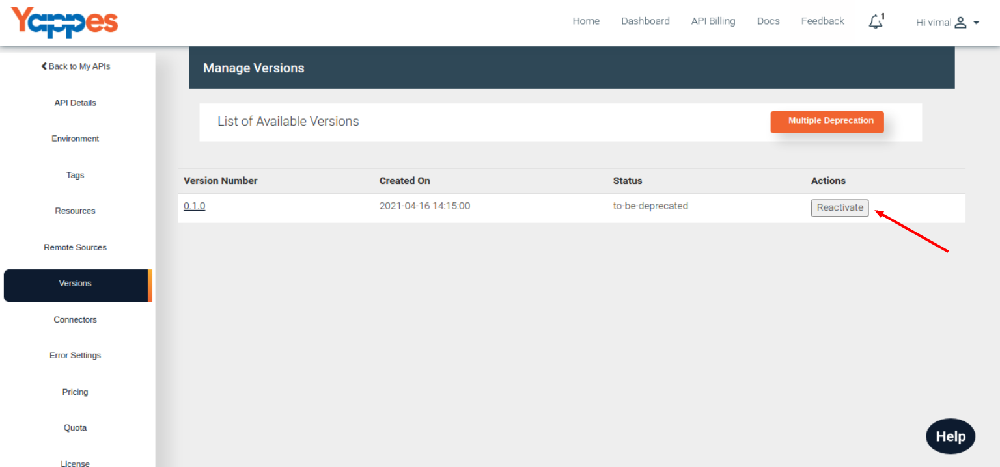
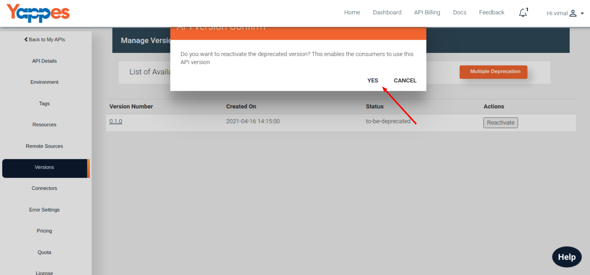
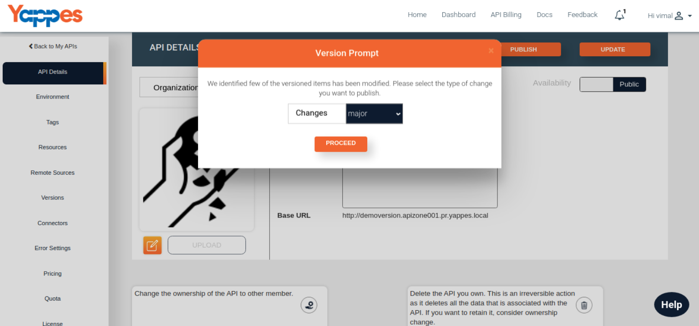

Deprecate/Reactive Version
==========================

-   Click on the Deprecate button from the selected version row and the
    pop-up will be opened with deprecation details.
        
-   Select the Period (Hours, Days, Months) in which the version will be
    sunsetted or no longer accessible.Provide the value field with the
    corresponding numbers.
    
-   Once the operation is completed, corresponding response will be
    viewed in the pop-up.
    
-   If the API is successfully deprecated then "Reactivate" button will
    be visible under the Action column
    
-   If you click on the Reactivate button that specific version gets
    Reactivated.
    
-   Post reactivation, the specific version will available for
    applications to consume.Also the Deprecate button will be available
    for future actions.
    
-   For Each API update cycle, if the updation involves API design then
    application will automatically prompt for versioning with proper
    type as patch, minor or major
    

Next we will see in detail about Deprecate Multiple Version

[**Next
Deprecate Multiple Version**](deprecate_multiple_versions.md)
