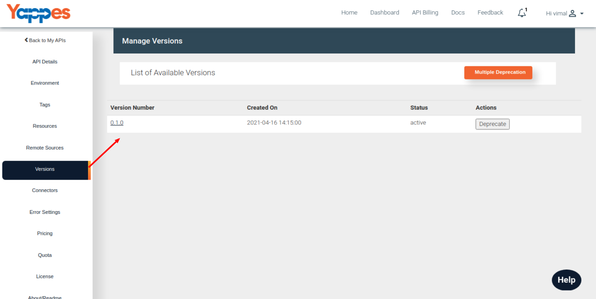
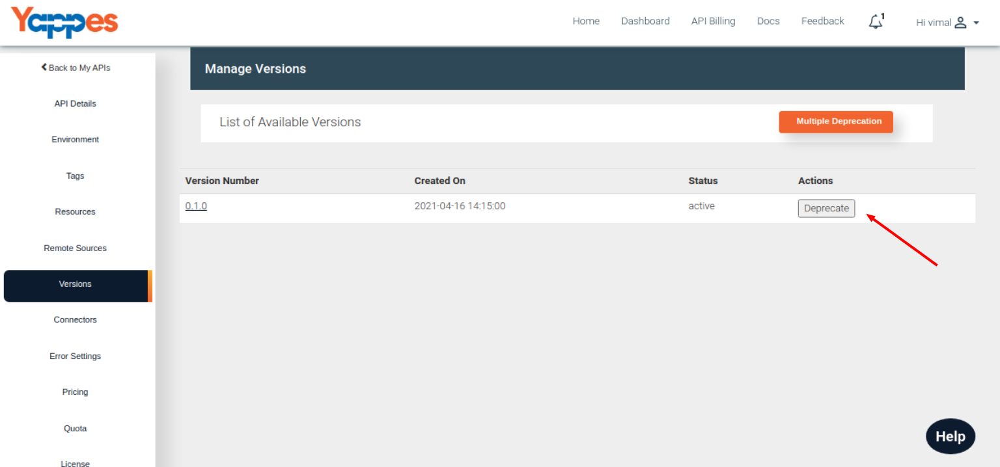

View Single Version
===================

-   Navigate to the Version tab to view the list of published versions.
    
-   From the list of versions in the table, click on the Version Number
    which will open the version specific API documentation in the new
    tab.
    

Next we will see in detail about Deprecate/Reactive Version["Next :
Deprecate/Reactive Version"](deprecate_reactivate_versions.md)
