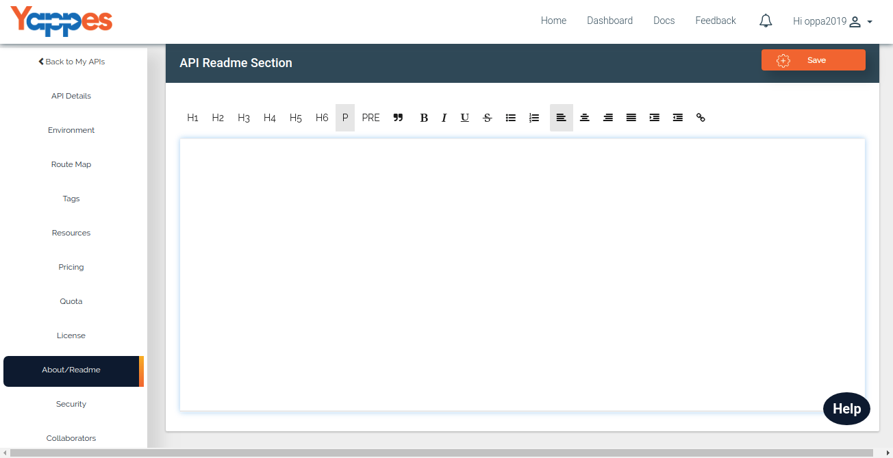

About/Readme
============

API Provider can mention the detailed information of their APIs like,

-   How to get the credentials for accessing your API?
-   Contact Details and other required information related to your API

1.  You can type in or copy & paste the information related to your
    APIs.You can format the text in the way you needed
    -   You can use this Text editor and format the text by using the
        options provided in the editor.
    -   i.e H1,H2,H6,Bold,Italic,Underline,align,etc.
2.  After completing the About/Readme section you can save it for the
    further use.
    -   Save - Click on save ,Once you completed this section
    -   Update - If any editing is done, it can be save by clicking on
        the "Update" button.
3.  After this we will see in detail about the platform security
    section["Next : Security"](security)
