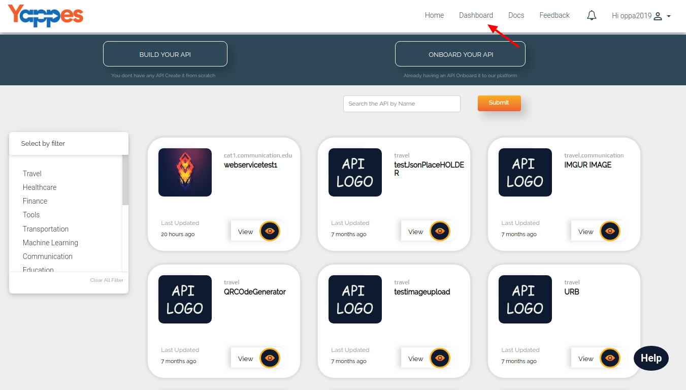
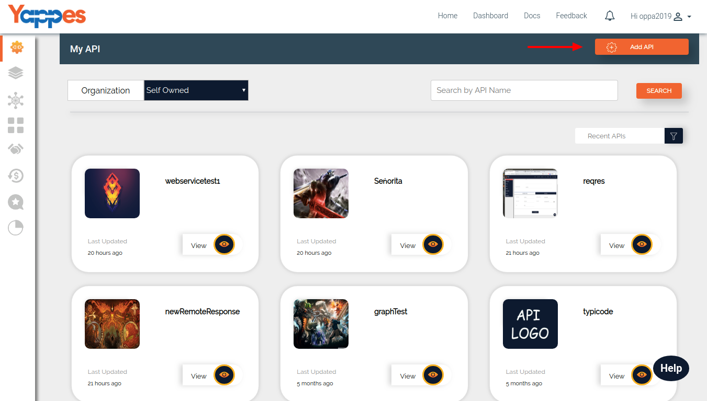
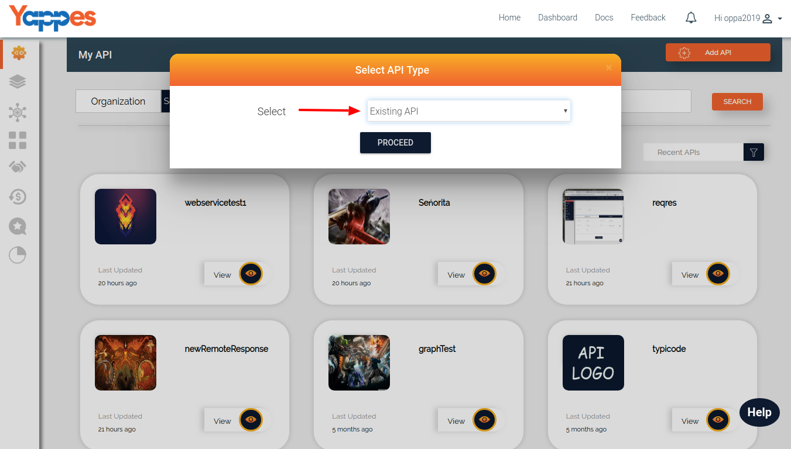

Create an Existing API
======================

It is very easy to on-board an API to our Yappes platform. If you have
an working API, then just follow the below steps to on-board an API.

All the APIs will be managed under Dashboard which we will study in
detail in the section ["What is in My Dashboard?"](dashboard.md).

1.  Login to the Yappes Application
2.  Click on the "Dashboard" Link Or Click on "Onboard your api" in
    HomePage and goto [Step 5](#5)

    

3.  "My APIs" will be highlighted. In that Click on the "API" button.
    This will open a pop up window

    

4.  From the pop up window select **Existing API** and click on
    **Proceed** button.

    

5.  Once the API type is selected, it will prompt for the API details
    which we will cover in the next section ["Next : Provide API
    Details"](apidetails)
