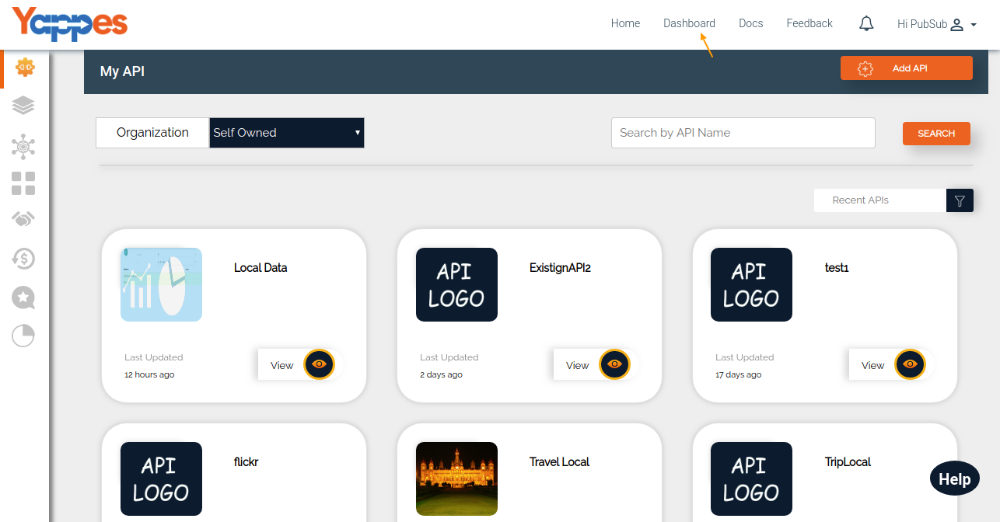
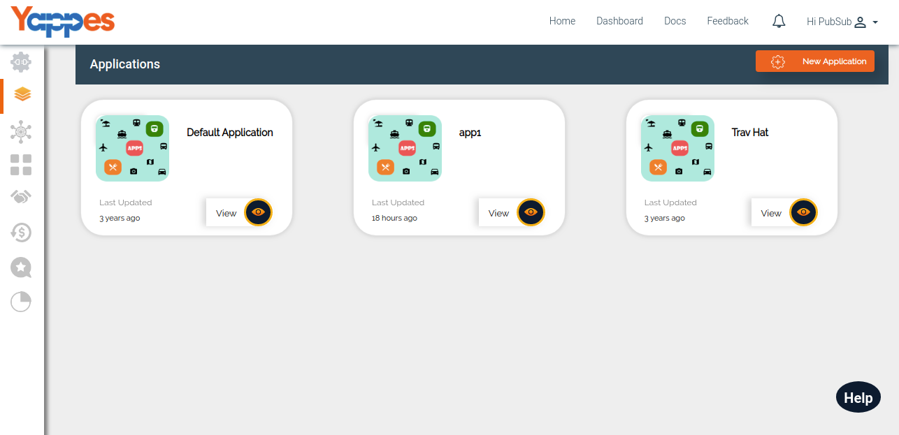
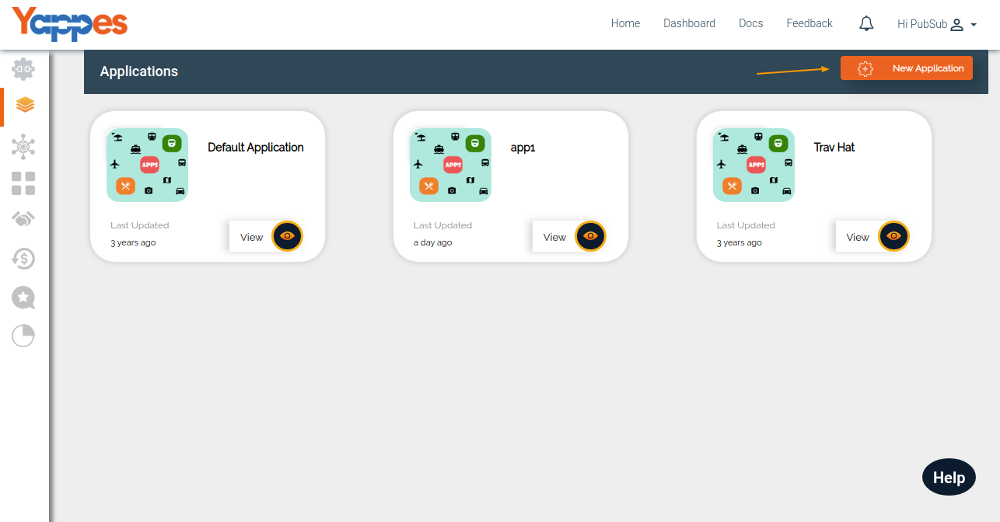

Applications
============

Applications are used to group similar APIs for better tracking of the
API usage and security.

All the request to Yappes platform are validated against the
application-keys which we discuss in detail in the keys section
["Application Keys"](appkeys)

Whenever the User signs up to our Yappes Platform, "Default Application"
will be created.

1.  Users can navigate to the Application section under Dashboard

    

2.  Click on Application tab, which will list your applications. Note
    that there will be a "Default Application" for every user.

    

3.  To create an Application click on "New Application" button.

    

4.  In the next section, we will see how to create an applications in
    detail ["Next : Create Applications"](appdetails)
