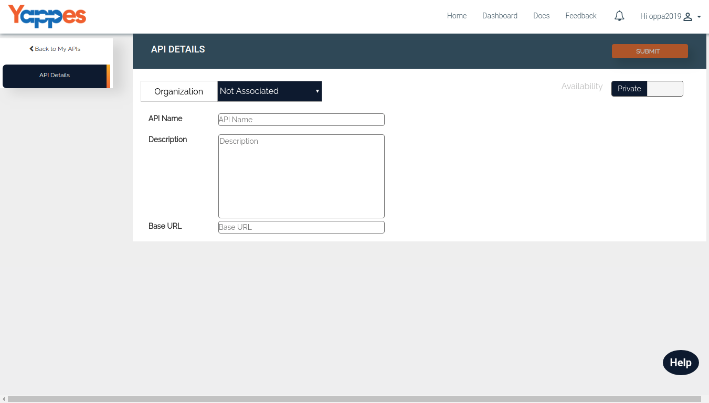

API Details
===========

At the initial steps the user will be prompted to provide only the basic
details as shown in the below picture

1.  API Name - API Name which will be visible to the users once it is published.
2.  Base URL - This is an accessible URL for your api in the format as below
    {scheme}://{hostname}:{port}  
    Example: https://api.yappesexample.com
3.  Description - Provide a brief description about the API like What it
    does, which service it provide, etc. Under this provide only the
    overview of the API, there is a detailed [**About**](aboutapi)   <!--Broken link--> section
    where you can explain about the prerequisites and other needed
    information in detail.
4.  Availability - It determines whether the published API should be
    made available to all the platform users or only to the
    collaborators.It has two values.
    -   private - visible only to the collaborators.
    -   public - visible to all.
        the platform users
  <!--Public/ Private are Accessibility features. See if want to change.-->
    By default, it will be **Private**.
    
5.  Once all the details are entered, click on the **Submit** button. As
    soon as the API is submitted, it will change in to Update Mode where
    you can see the list of other details that needs to be provided for
    the API.
6.  We will go through in detail in each of these section.

[Next :
    Environment Details](environment.md)

 
<!--
As per my discussion with Shiva point 2. Base URL is the URL of an existing API which have been already hosted somewhere by Developer.
In that case pls make it as 
Example: https://api.MyCompany.com
-->