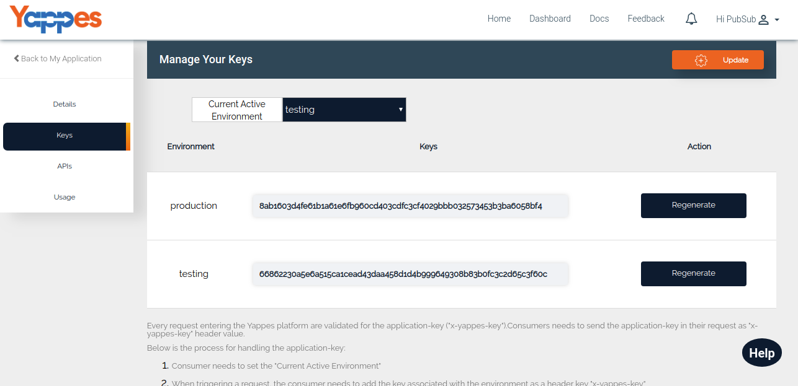

Application Keys
================

Under the keys section the users can manage their **Application-keys**.

Whenever the User signs up to our Yappes Platform, **Default Application**
will be created with two different keys 

* Production Key 
* Testing Key

By default the current active environment will be **Testing**.If the keys are compromised or misused, they can always be regenerated
using the **REGENERATE** button.

Below is the Process for handling the application-key
<!--Required Screen shot -->
1.  Consumer needs to set the **Current Active Environment**. 

2.  When triggering a request, the consumer needs to add the key
    associated with the environment as a header key **x-yappes-key**

3.  Our Yappes platform will validate the key and process the request
    accordingly.

        
Every request entering the Yappes platform are validated for the
application-key (**x-yappes-key**).Consumers needs to send the
application-key in their request as *x-yappes-key* header value.

In the next section, we will see all the APIs related to an Application

[**Next : Application APIs**](application_apis.md)
