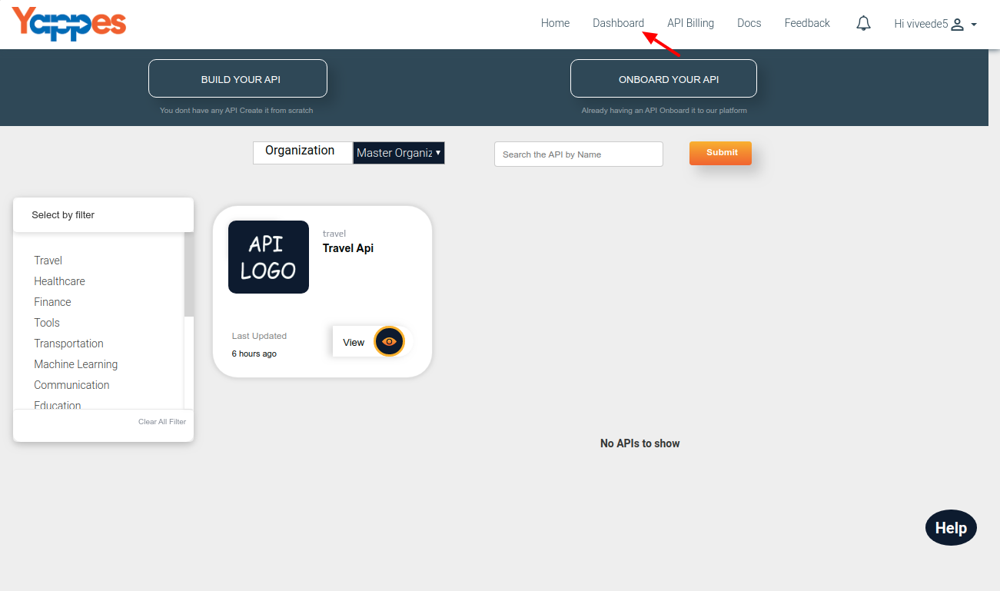
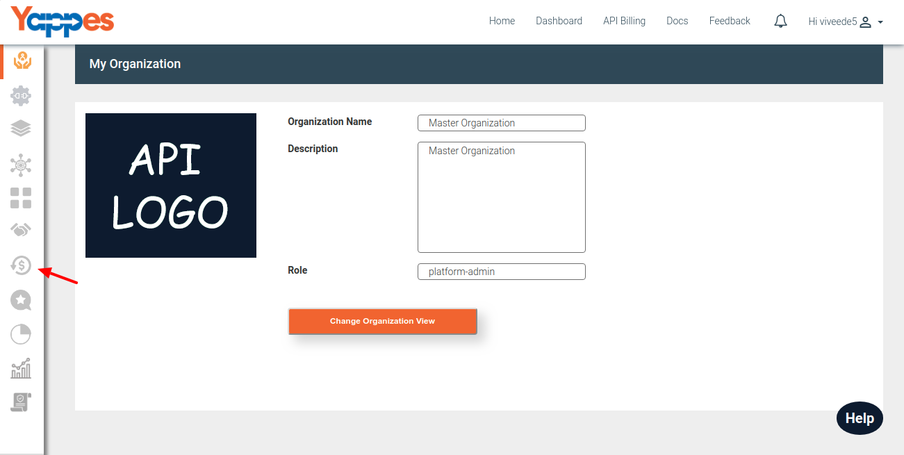
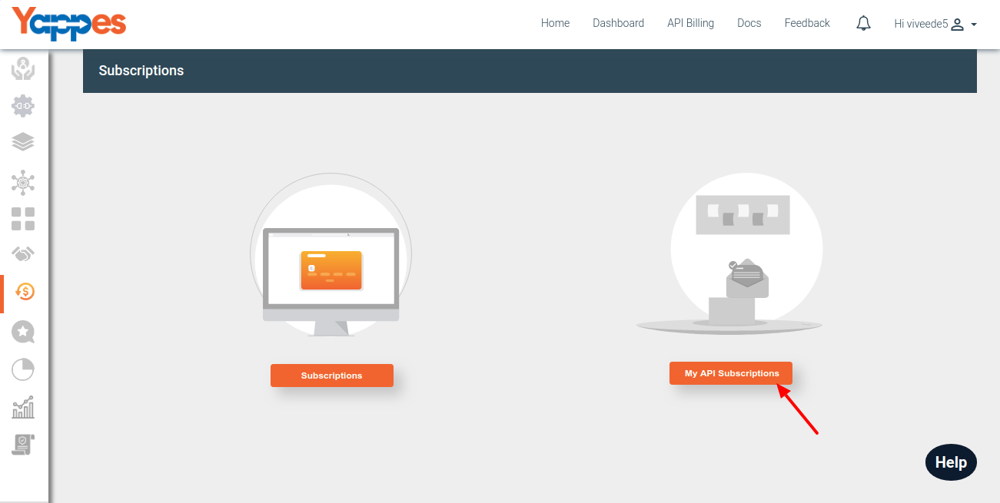
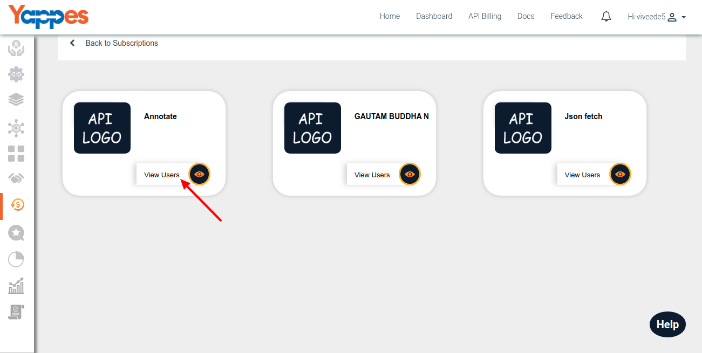
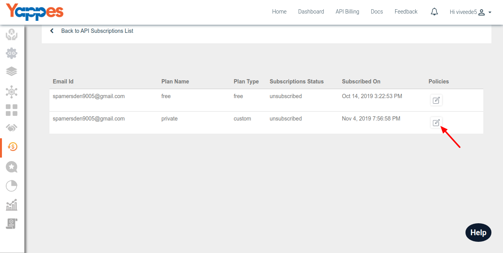
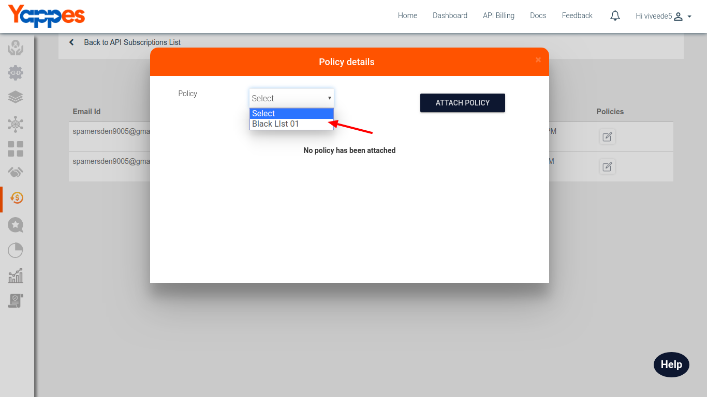
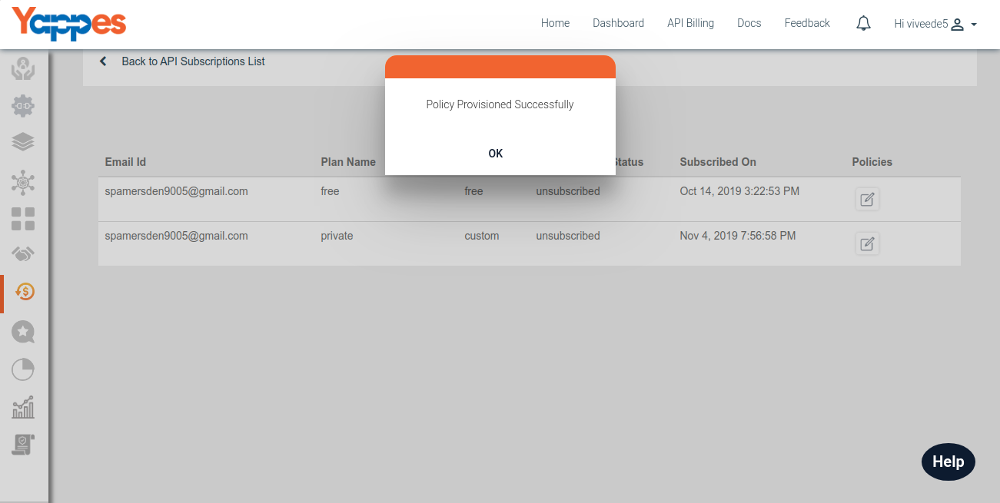
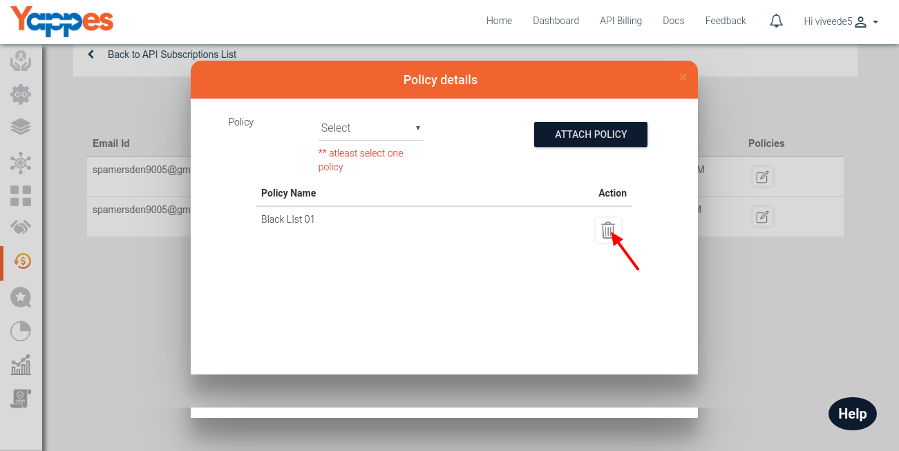
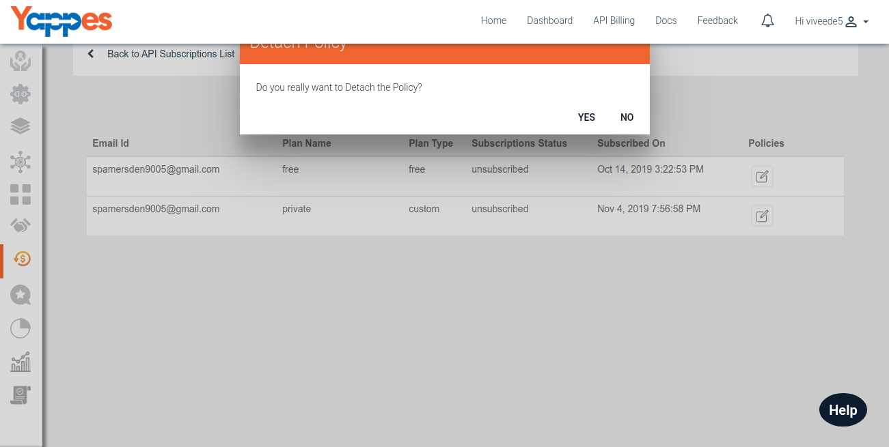

Attaching Gateway Policies to subscriptions
===========================================

1.  Attach Policy
2.  Remove Attached Policy

### Attach policy

1.  Click on subscription Icon under dashboard.

    

2.  click on "My Api Subcriptions".

    

3.  Here all list Api are present, which are subscribed users. now Click
    on "View Users".

    

4.  Under Api subscription list table select User to attach policy by
    clicking respective icon under "policies" column.

    

5.  Select policy to be attached from dropdown selection. add click on
    "ATTACH POLICY".

    

6.  policy is successfully attached.

    

### Remove Attached policy

1.  Click on "policies" column icon of the table .

    

2.  In pop up promt under attached policy table list, select delete icon
    under action column.

    

3.  Confirmation prompt will be having "yes" or "no" option for deletion

    

Next we will see how to use our CLI tool for development of APIs ["Next
: CLI Tools"](cli_tool)