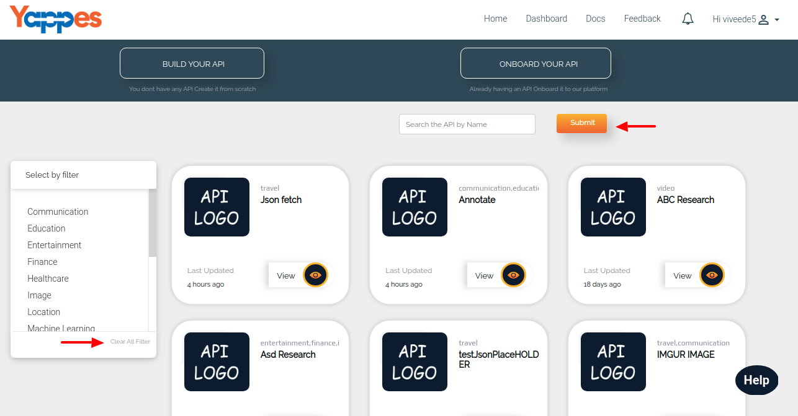
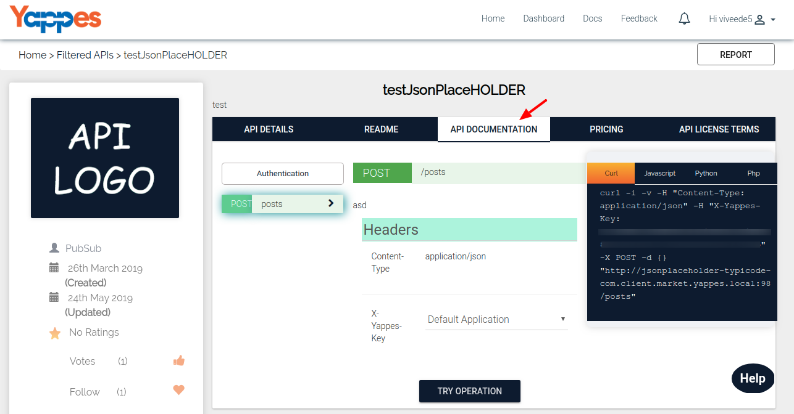
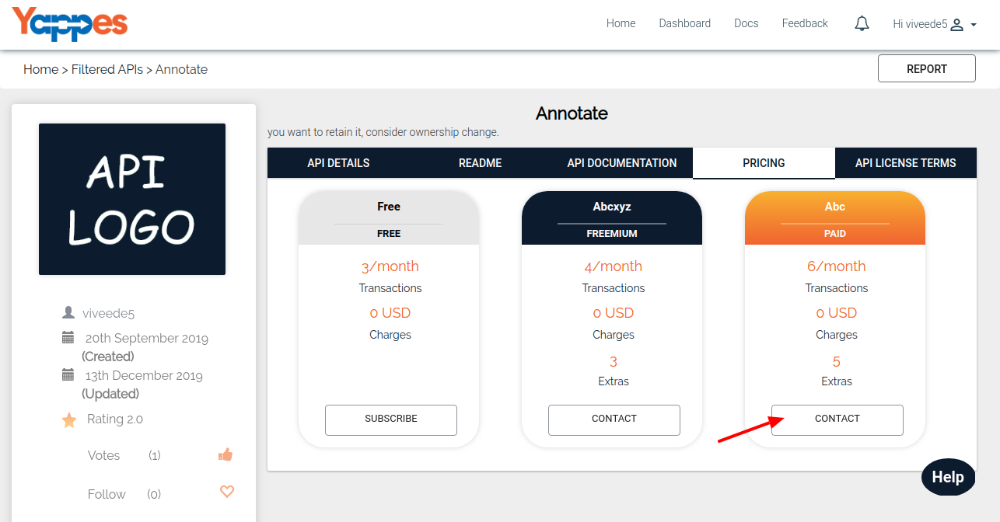

Consume API
===========

All published APIs will be made available when the Consumers search in APIs List.

**Steps for Consuming an API**

1.  Discover an API either by Searching or applying filters.

    

2.  Click on *View* button of  the API and select **API Documentation** tab.

    

3.  Under the Pricing Tab, click on the **Contact* button to initiate the
    deal process.

    

4.  Once the deal is negotiated.Then the API will be subscribed and the
    consumer can start using it.We will see in detail about the deal
    room process under the section [**How Deal Room Works?**](managedeals.md)
5.  Consumer needs to integrate the CURL template code with their
    application to access the API data.
6.  We will now see how to filter and view the published APIs in the
    next section.
    
    [**Next : Filter and view API**](consume_filter_api.md)
