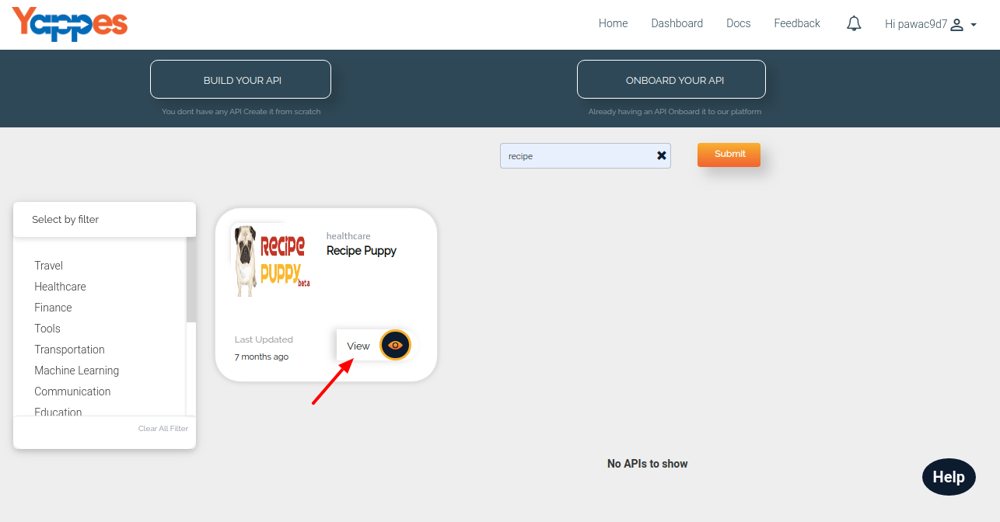
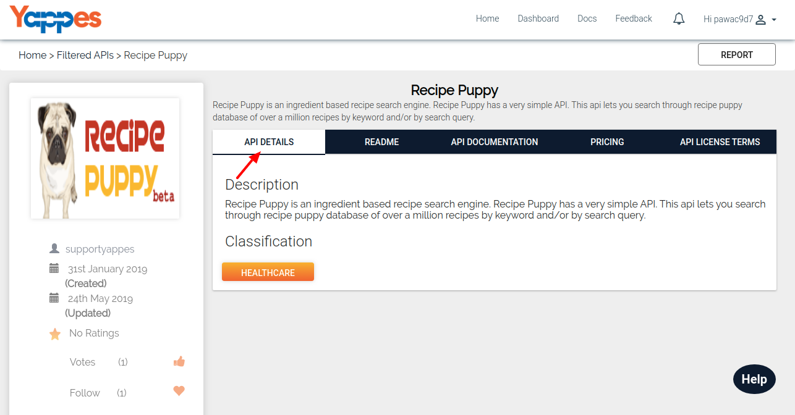
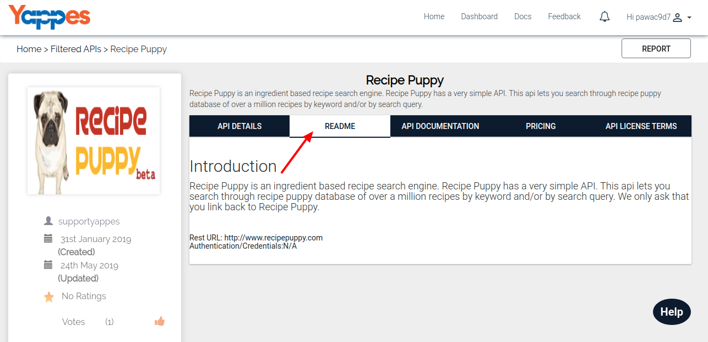
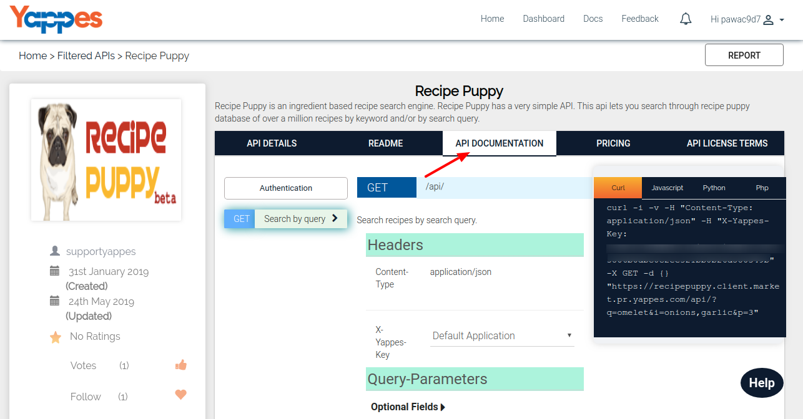
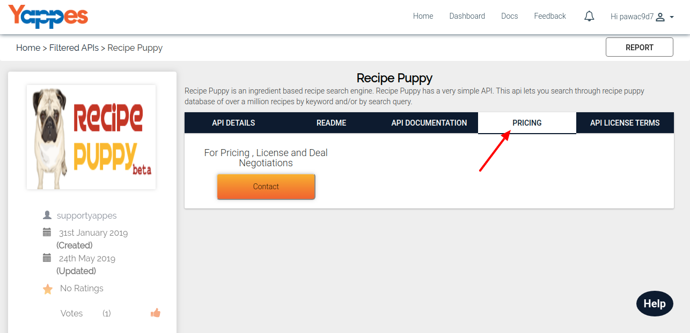
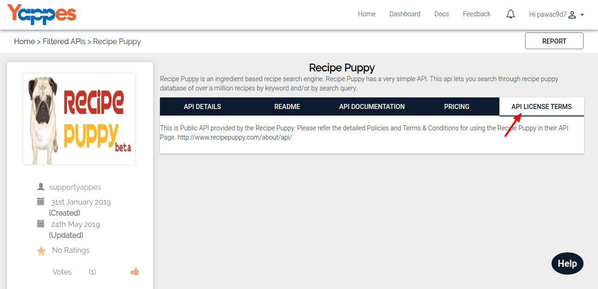
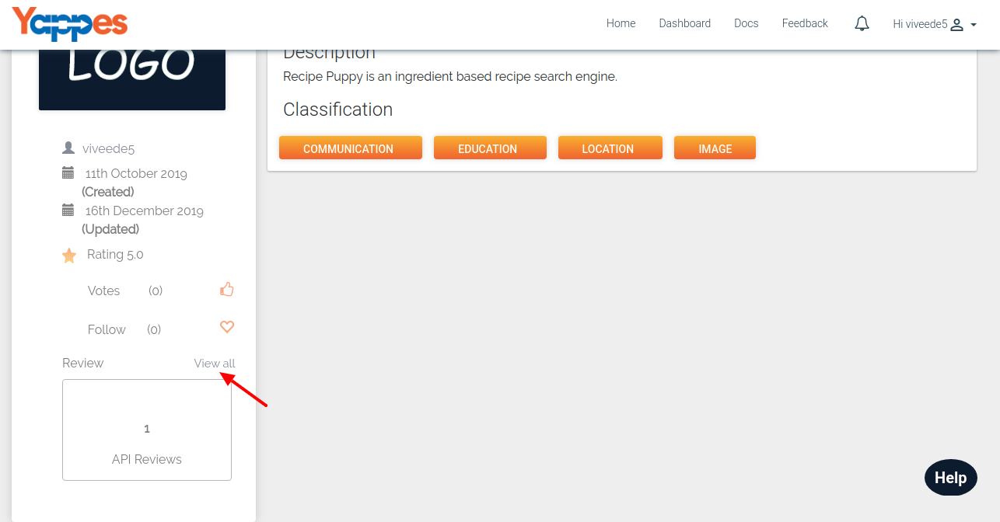
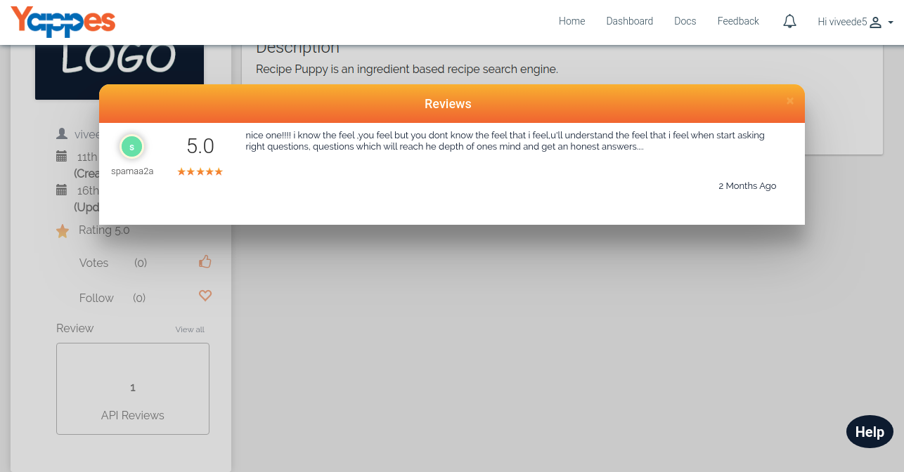

View API
========

Consumer can view the following information related to an API

1.  API DETAILS
2.  ABOUT
3.  API DOCUMENTATION
4.  PRICING
5.  API LICENSE TERMS
6.  REVIEW AND RATINGS

1.  First tab is API Details. It will show a brief description about the
    API and also show its associated travel service tags.

    

2.  Next is About section. It will show a detailed description about the
    APIs as mentioned by the API Provider.

    

3.  Then comes Documentation. All API Endpoints will be listed here,
    also consumer can test all Endpoints from this tab. On how to test
    is described in detail in the section. ["Preview the API
    Documentation"](preview)

    

4.  The next is Pricing details. All the active pricing plans will be
    listed here. Consumers can initiate the deal process with the api
    provider on clicking "Contact" button which will be discussed in the
    section ["Manage Deals"](managedeals)

    

5.  Next is License Terms section. It will show the licensing Terms and
    Conditions as mentioned by the API Provider.

    

6.  Consumer can view all "Reviews and Ratings" for that API. These
    reviews and ratings will be helpful in determining the quality of
    the selected API.

    

    

7.  In the next section, we will see about the Dashboard section ["Next
    : Dashboard"](dashboard_details)
