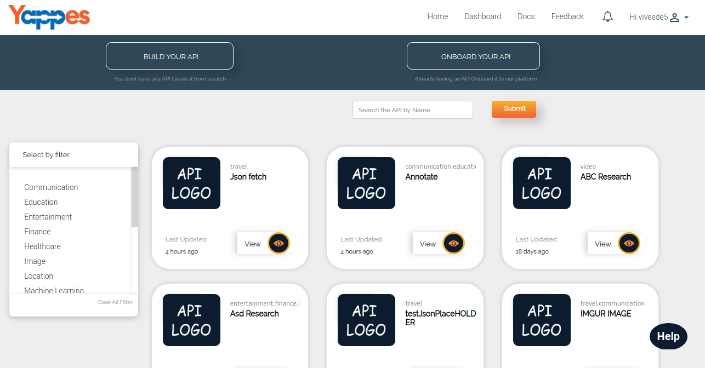

Filter and View API
===================

After login, all published APIs will be listed on in the homepage.

Also, there will be a pre-defined list of tags of travel services in the
left side which can be used for filtering the APIs. <!--travel services term in not clear-->

1.  After clicking respective tags, our Yappes will filter out the APIs associated
    with the selected tags and display in the API List window.

    

2.  On clicking view button, all the API details like Details, ReadMe,
    Documentation, Pricing, etc will get displayed. [**View an API**](consume_apiview_docum.md)

3.  We will now see **How to search apis?** in the next section 

[**Next : Discover API**](discover_search_api.md)

<!--Please confirm links for view and discover-->
