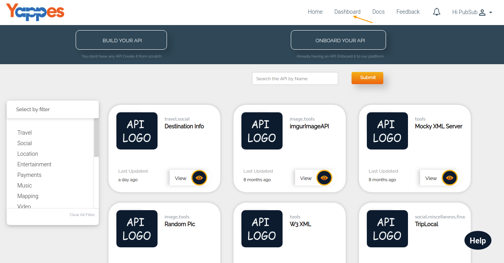
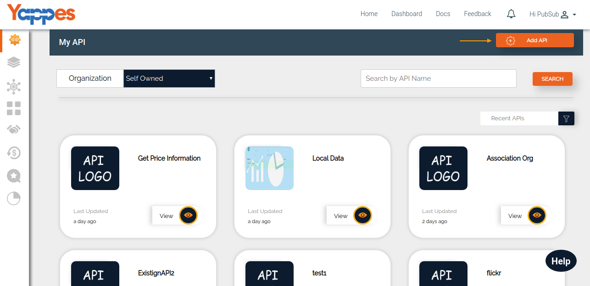
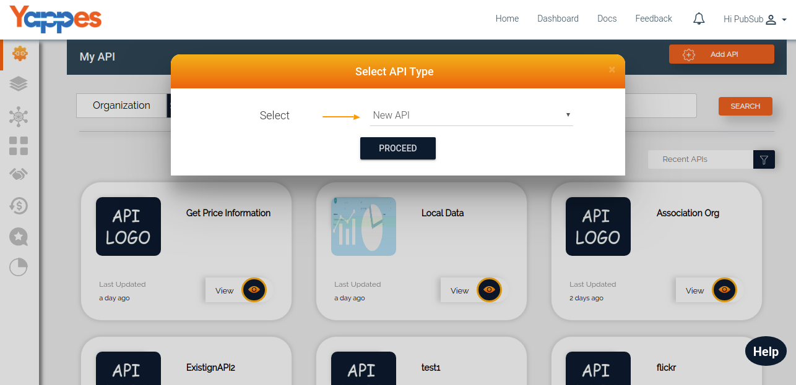
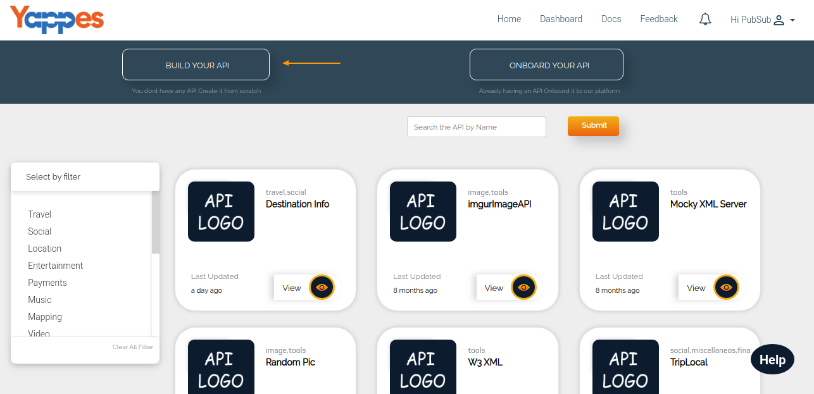

Create a New API
================

It is very easy to on-board a new API to our Yappes platform. Follow the
below steps to create a new API.

All the APIs will be managed under Dashboard which we will study in
detail in the section ["What is in My Dashboard?"](dashboard_details).

1.  Login to the Yappes Application
2.  Click on the "Dashboard" Link or Click on the "BUILD YOUR API" in
    Homepage goto [step 6](#step-6).

    

3.  "My APIs" will be highlighted. In that Click on the "API" button.
    This will open a pop up window

    

4.  From the pop up window select **New API** and click on **Proceed**
    button.

    

5.  Once the API type is selected, it will prompt for the API details
    which we will cover in the next section ["Next : Provide API
    Details"](apidetails_new)
6.  Click on "BUILD YOUR API" and you will be directed to screen for
    entering API details

    

7.  Once you click "BUILD YOUR API", it will prompt for the API details
    which we will cover in the next section ["Next : Provide API
    Details"](apidetails_new)
