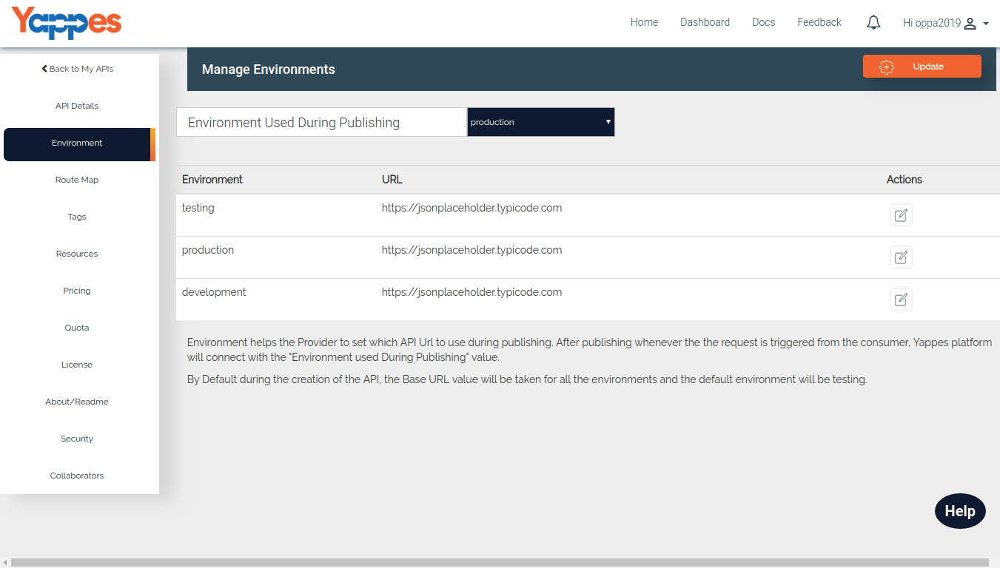

Environment Details
===================

Environment helps the Provider to set which API Url to use during
publishing. 
After publishing whenever the the request is triggered from
the consumer, Yappes platform will connect with the **Environment used
During Publishing** value

Currently Yappes provides three types of Environment.

* Testing
* Production
* Development

By Default during the creation of the API, the Base URL value will be
taken for all the environments and the defautl environment will be
testing.

1.  User can change the environment used during publishing the API .
2.  Three types of environment and corresponding base url will be
    displayed here.The provider can edit the base url when needed.
3.  All the on-boarded APIs will have have their API requests routed through Yappes Platform. Please follow the link for details .

[Next : Route Map Details](route_map.md)

<!--
1. The explaination is little confusing as all the environments showing URL. Need more explainable if at the same time all envrionments are active.
For example, already some APIs in production. How to deploy on test envrioment and test while not disturbing PROD.
2. Add information about edit icon for each row in action column.
3. The provider can edit the base url when needed. <= this needs to be edited on API Details screen?
4. Please change URLs to https://api.MyCompany.com
-->