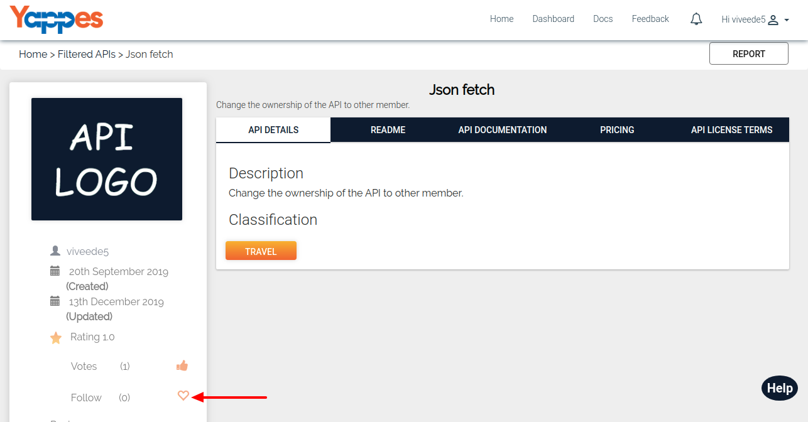

How to Follow / UnFollow an API?
================================

Yappes allows the logged in users to keep track of the APIs. 

It is acheived by *Follow* option for the API and if any changes or updates done to the
API then the following users will be notified for the same. 

Users can un-follow the API as well if they wish not to track it.

Under this section we will see in detail of **How to follow / un-follow an
API?**

1.  Users can Follow the API by clicking the Empty Heart button.Total
    number of followers of this API is also displayed here.

    

2.  If the logged in user is already following the API ,Then the empty
    heart button is filled along with total number of followers.

    

3.  If the user wish not to track th API ,then he/she can un-follow the
    API by clicking the filled heart button.

    

4.  After this we will be looking in to Voting and Cancel Voting of an
    API.
    
    [**Next : How to Vote / Cancel Vote?**](vote_cancelvote_api.md)
