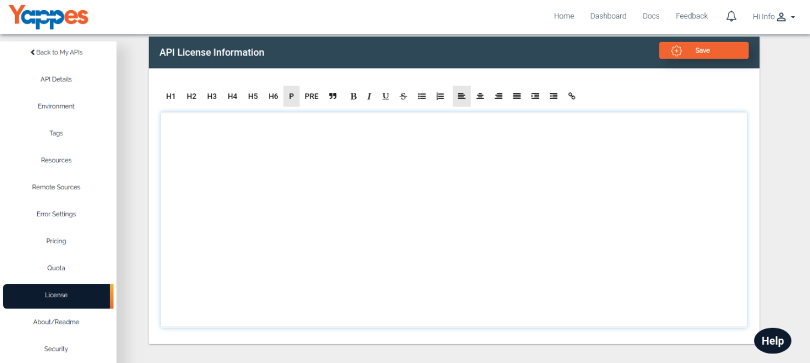

API Terms and Conditions
========================

API Provider can use this section to mention their **Terms and Conditions**
to use the APIs. 

It is provided as rich text format which makes the user
to provide all kinds of formatting or beautification to his/her APIs.

1.  You can type in or copy & paste the T&C related to your APIs.You can
    format the text in the way as you need. 
    -   There are various options provided in Text editor for formating.e.g H1,H2,H6,Bold,Italic,Underline,align,etc.
2.  After completing the terms and condition you can save it for the
    further use.
    -   Save - Click on save ,Once you completed the Terms and
        conditions.
    -   Update - If any editing is done, it can be save by clicking on
        the **Update** button.
3.  After this we will see about /Readme Section of an API [**Next :
    About/Readme**](about.md)
