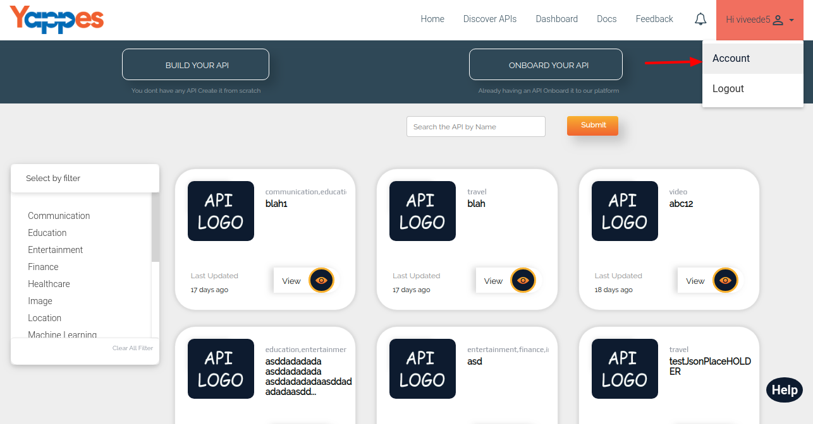
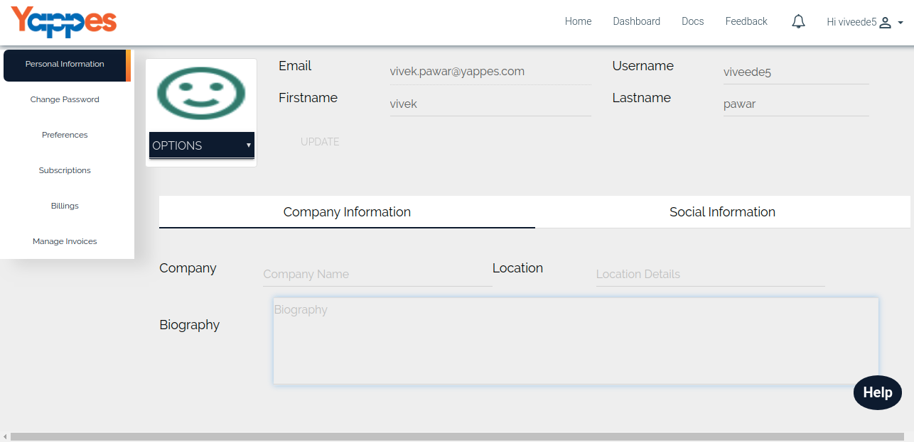

My User Profile
===============

User profile gives the detailed information about logged in
user.Clicking on the **Username** on top left corner will display the
account tab.

Click on "Account" and you will be redirected to the profile view.

1.  Profile of the user contains the following informations.
    1.  **Basic Information** - It includes Email
        Id,Firstname,LastName,Username,Whether need to enable Tutor etc
        details.
    2.  **Other Information** - Other information is nothing but the
        Location,Company Details,Biography etc.
    3.  **Social Information** - All the details related to social
        networks.i.e Facebook,LinkedIn,Twitter,Stack Overflow.
2.  We will cover the public profile of an API provider in the next
    section.
    
    [**Next : API Provider Profile**](apiprovider_profile.md)
