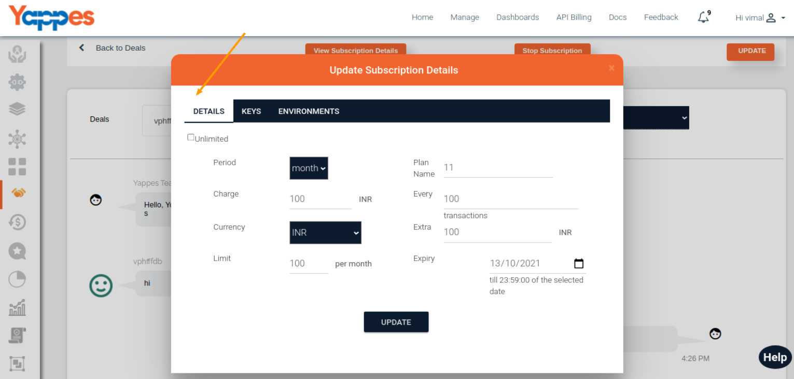
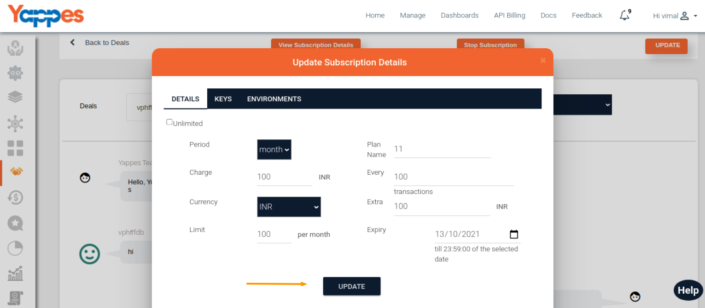
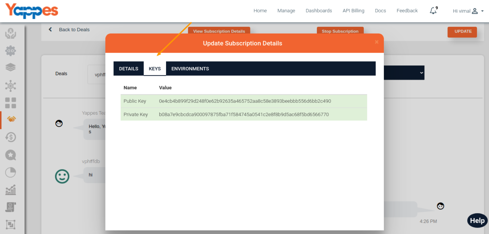

Manage Subcription Details
==========================

1.  When you click the **View Subscription Details** Button it will show the
    model.
    <!--Please check button name-->
    

2.  In this model, you can see 3 tabs namely 
 
    * Details
    * Keys
    * Environment 

In the details tab, you can see details regarding the
    Subscription detail.

    
 

If you want to change anything in the subscription you can modify on this page.

In the keys tab you can see the public and private key details.

In the next section, we will see **How to Manage Environment Access?**

[**Next : Manage Environment Access**](subscription_manage_environment_access.md)
