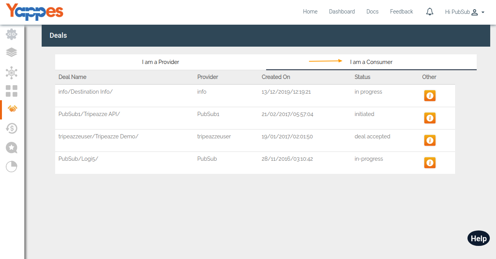
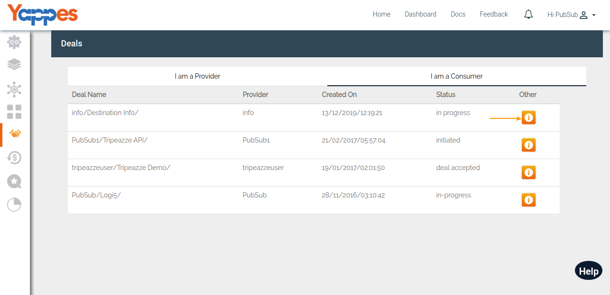
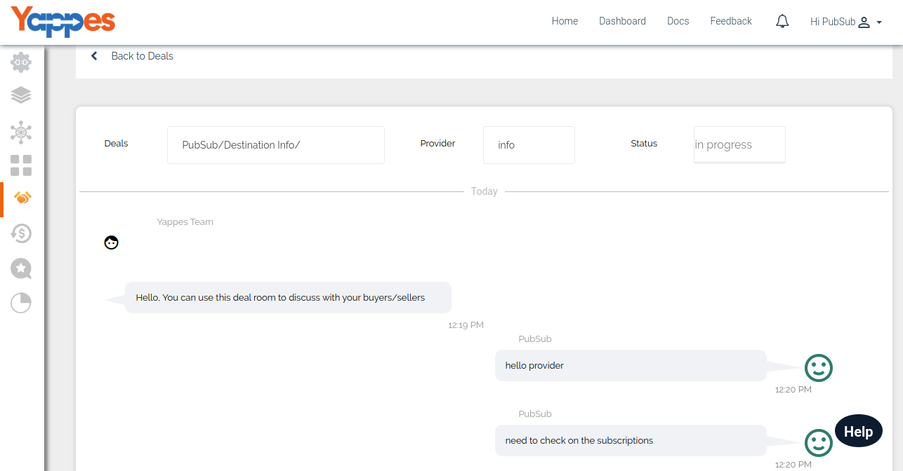
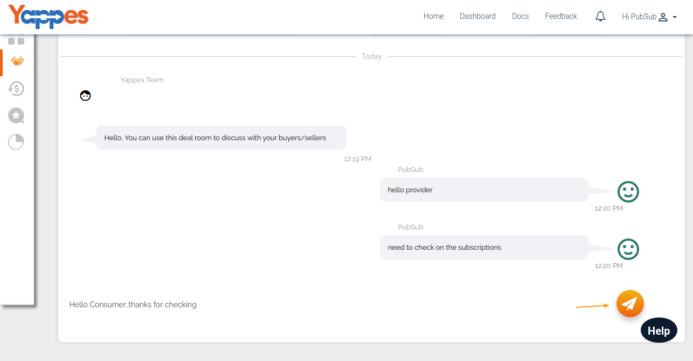

Manage Deal as a Consumer
=========================

This section allows the consumer to view and manage all deals.

1.  To select a particular deal, click on detail button of a deal.

    

2.  After clicking, it will display all the deal details like deal name,
    provider and deal status.

    

3.  Also, consumer can have a real time chatting with the provider.

    

4.  In the next section, we will see how to manage Subscriptions ["Next
    : API Subscriptions"](manageSubscriptions)
