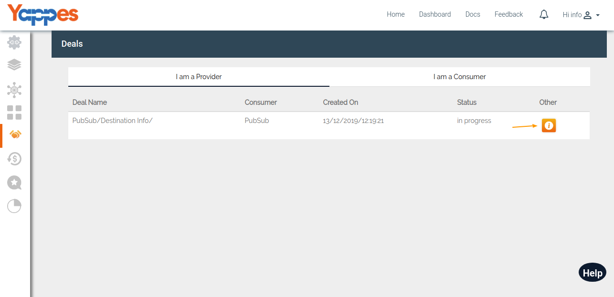
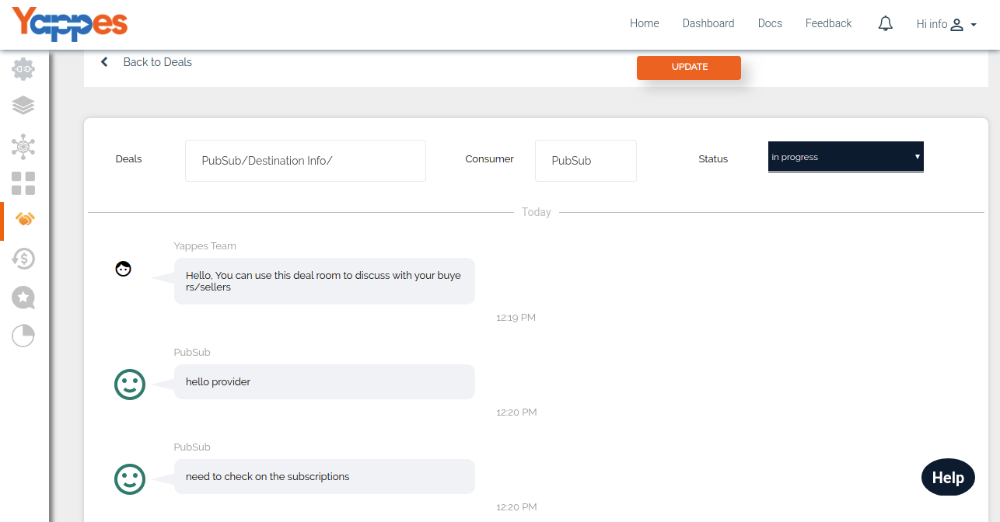
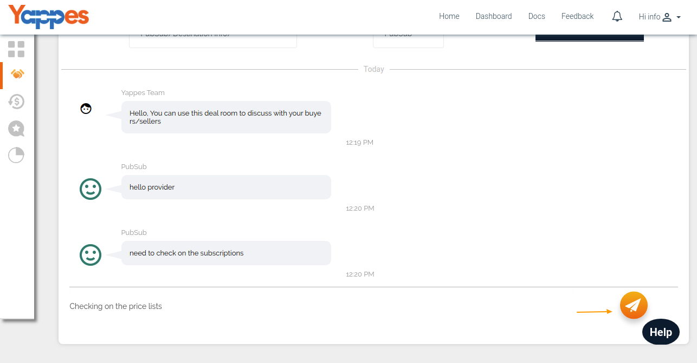

Manage Deal as a Provider
=========================

Under this section we will see how an *User as an API provider* can manage the
Deals.

1.  To select a particular deal, click on **Detail** button of a deal.

    

2.  After clicking, it will display all the deal details like Deal
    Name(Consumer UserName/API Name), Consumer and Status. Status can be
    changed only by the API Provider and not by the API Consumer. Status
    for deals can be changed by selecting the dropdown. Different status
    for a deal are :

    -   In-progress
    -   Closed
    -   Rejected
    -   Deal Accepted

    

3.  Also, Provider can have a real time chatting with the Consumer.

    

4.  Provider can start the Subscription of the API once the status is
    **Deal Accepted**, which we will be discussing in detail in the
    section [**API Subscriptions**]subscriptions.md)

5.  In the next section, we will see how to manage deals as a consumer,

    [**Next : Manage deals as a consumer**](managedeals_consumer.md)
