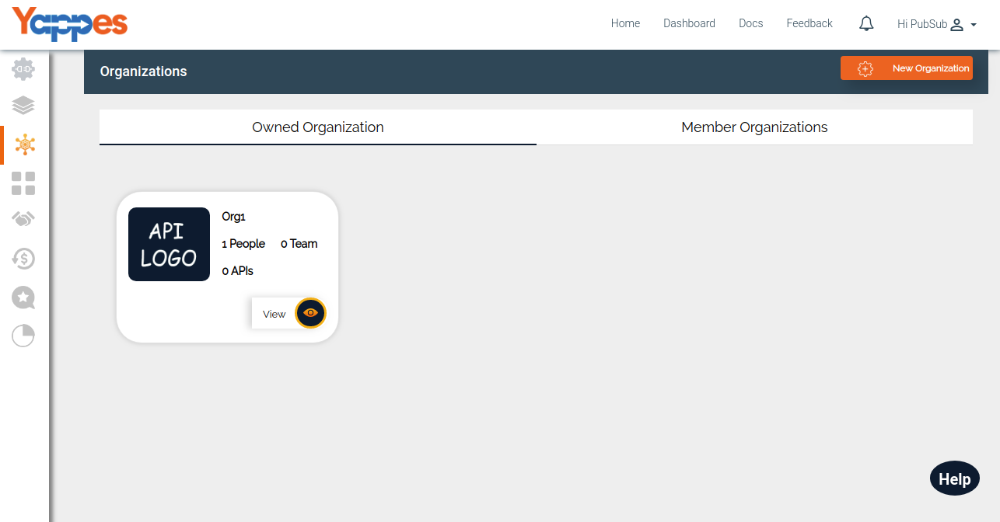
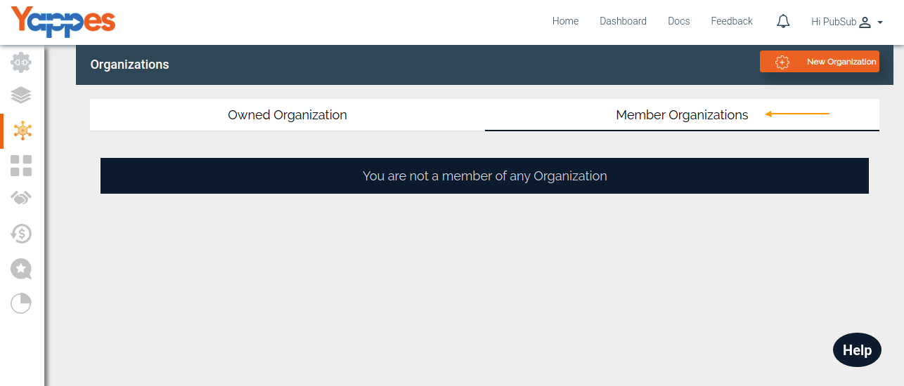

Organizations
=============

Yappes provides capability for users to organize and manage the APIs in
a controlled manner. The controlled nature is delivered via the feature
"Organizations" where the user can create, update, delete Organizations
and also map users, associate APIs and teams. Each organization has been
enabled with RBAC(Role-Based-Access-Control) sets powered by fixed roles
"owner", "api-reader" and "api-creator". In the following section and
its subsections, we will get in detail about how we can use the
"Organization" feature.

1.  The user can navigate to the Organizations section under Yappes
    Dashboard

    

2.  Click on Organizations tab, It will list user owned organization and
    user member organization.    
    Note: if you don't have any organization it shows the following
    message in Owned Organization tab **(You are not owning any
    Organization. Click on 'Add Organization' to create one)** and
    Member Organizations tab **(You are not a member of any
    Organization)**    
3.  You are not owning any Organization. Click on 'Add Organization' to
    create one
4.  "Member Organization" tab list the organization in which you are a
    member with role "api-reader" or "api-creator".

    

5.  In the next section, we will see how to create an organization in
    detail ["Next: Create/Edit an
    organization"](organizations_create_edit.md)