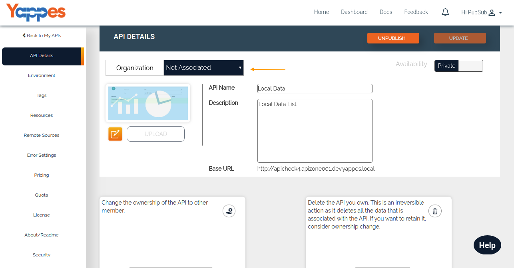

Associate API with Organizations
================================

Yappes provides the "Organization" feature to organize and manage the
APIs in a controlled manner. In the previous section we have seen the
different funtionalities as part of the Organization. Now we see how to
associate and disassociate an API with respect to Organization. One API
can be associated with only one Organization.

1.  In this section, We are going to see how to associate API on the
    time of creation.    
    **Note: For associating API with the Organization, You must be
    having "owner" or "api-creator" role in that Organization. Only you
    can associate API with your owned organization.**

    

2.  On the time of clicking Add API button it will open the popup with
    the dropdown New API and Existing API.    
    **Note: For New API and Existing API the Procedures are same for
    associating of API with the organization.**

    

3.  For this let us consider creating "New API"and associating it with
    an organization.

    

4.  Select the Organizations from the dropdown and Enter the details
    about the API Name, Description, Availability and click on submit.

    

5.  After a successful submit, you can see the API is associated with
    the organization.

    

6.  When you scroll down you can see the Important Block along with the
    buttons CHANGE OWNERSHIP and DELETE API.    
    **Note: You must have the role as "owner" of the associated
    Organization to see this block.**

    

7.  Following we see how to associate an already created API with the
    organization.

    

8.  When you click the Button View It will open the View API details
    page.

    

9.  You can see the details about the API Name, Base URL, Description,
    Availability and Organizations Drop Down.Click the dropdown and
    select the Organization Name    
    **Note: If API is not associated with organization You are able to
    see the Dropdown, otherwise you can only see the associated
    Organization name.**

    

10. After the successful UPDATE, you can see the associated organization
    name on right to the organization label

    

Next we will see how to Add Gateway Policies ["Next : Gateway
policies"](gateway_policy.md)