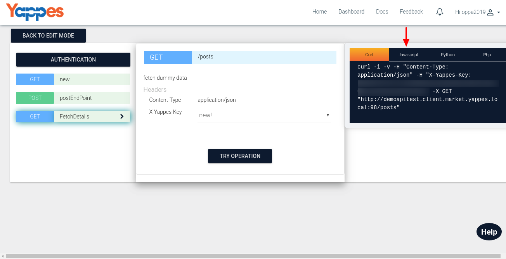
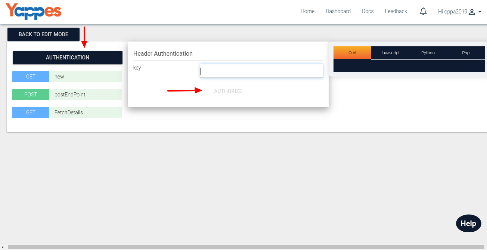
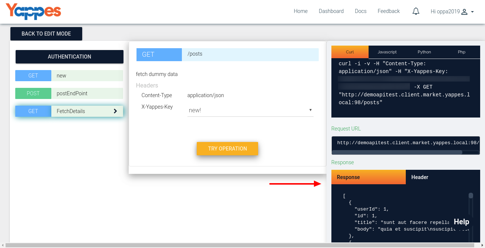

Preview the API Documentation
=============================

API Provider can test the Endpoints added using the preview mechanism.
This is the view which the consumer will be seeing as part of discovery
process which we will go through in detail under the section [Consumer
API View & Documentation](apiviewdoc)

1.  Here you can see that the "Preview" is categorised as 3 sub
    sections.
    -   First Section contains the endpoints you have already created
        and **"Authentication tab"** which is used to set the
        authenticate for the API.

        

        -   In this documentation we have used OAuth2 Authorization.It
            contains the following fields.
            1.  Call back URL - Yappes callback URL to reroute once the
                Authorization is done.It is not editable.You don't have
                to provide the value as it will be defaulted to
                "https://beta.yappes.com/oauth/callback"
            2.  Authorization URL - URL given when adding the
                authentication.It is not editable in preview mode.
            3.  Access Token URL - URL given when adding the
                authentication.It is not editable in preview mode.
            4.  Grant Type - Value given while adding
                authentication.Value will be either "Client credentails"
                or "Authorization Code".It is not editable in preview
                mode.
            5.  Scope - Values provided while adding authentication.It
                is editable .You can change the selection by
                ticking/unticking the checkbox.
            6.  Client Id - Id of the Client that is associated with the
                API.
            7.  Client Secret - Password/SecretCode of the Client
                associated with the API.
        -   Click on **"Authorize"** to verify the user.Once the user is
            authorized then only he/she can trigger the "Try
            Operation".Otherwise, wont be able to see the actual output.
            1.  If the grant type is "authorization code", clicking on
                "authorize" will redirect to the authorization page and
                user has to enter the username & password.After
                verification it redirect to the call back url and return
                back to the preview page.
            2.  If the grant type is "Client credentials",clicking on
                "authorize" will verify the client credentails and
                return the curl template.
        -   After authorizing the user,Click on each endpoint,give
            proper data and do "Try Operation".

    -   Second section contains the details of the selected endpoint.
        -   i.e when you creating the endpoint, you have the options to
            add Header,Query parameter,Form parameter etc.The provided
            details will be displayed here and you can edit it.
        -   There is one exra field called "X-Yappes-Key". You need to
            select one application. By default one value will be
            selected. We will look in detail about Application under the
            section ["What is Application?"](add_application)
        -   Click on **"Try Operation"** to get the result of the
            particular endpoint.The result will be displayed in the
            third section.
    -   The Third Section contains different SDK templates.Curl is
        selected by default. You can use these templates as part of the
        code integration.

        

        -   The output contains Request url,Response body,Response
            header and Response code.
            1.  Request URL - The url provided to get the response
            2.  Response Body - The actual content of the output
            3.  Response Headers - This field tells the headers we have
                got as part of executing the URL.

2.  Next we will check how to add pricing ["Next : Add Pricing
    details"](pricing)
