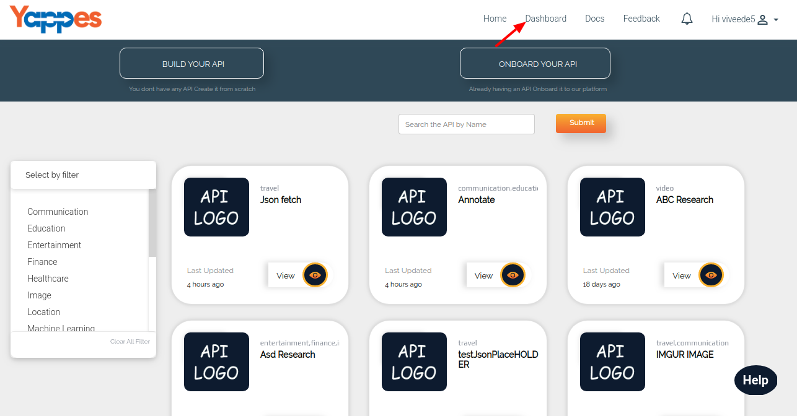

Publish API
===========

Once the API is created, next step is to **Publish** so it becomes
available for consumers during the search or discovery process.

**Steps Publishing the API:**

1.  Click on the **Dashboard** Link

    

2.  From My API's tab, click **View button of an API.**

    

3.  If the API is not already published, then **PUBLISH** button will be visible to publish API.

    

4.  Things to remember before publishing an api.
    -   API must be having atleast one tag.
    -   Atleast one resource end point must be added to your api.
5.  If the API is already Published, then 
    **UNPUBLISH** will be visible. You can use this button to unpublish
    the API and do some changes and publish it again.
6.  After this we will see **How to consume an api?**

    [**Next : Consuming an API**](consume_api.md)
