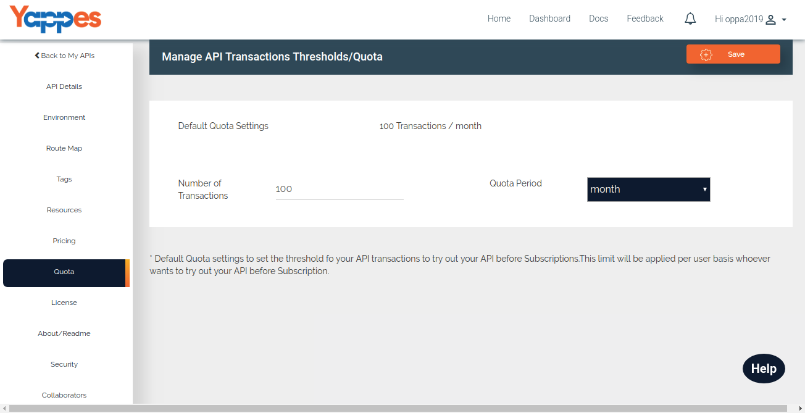

Quota
=====

Default Quota is used to the limit the transactions for trying out by
the consumers before they subscribe to your API.

API Provider can use it to define the "Number of Transactions" and the
"Quota Period".

By Default the number of transaction enabled will be 100 / month
whenever the API is created.

1.  As we said the default transaction will be 100/month for an API.That
    will be displayed under this section.
2.  API Provider can update -
    -   Number of Transactions.
    -   Quota Period - Period is either month wise or day wise.
3.  Next we will see the API Terms and Conditions. ["Next : API Terms
    and Conditions"](license)
