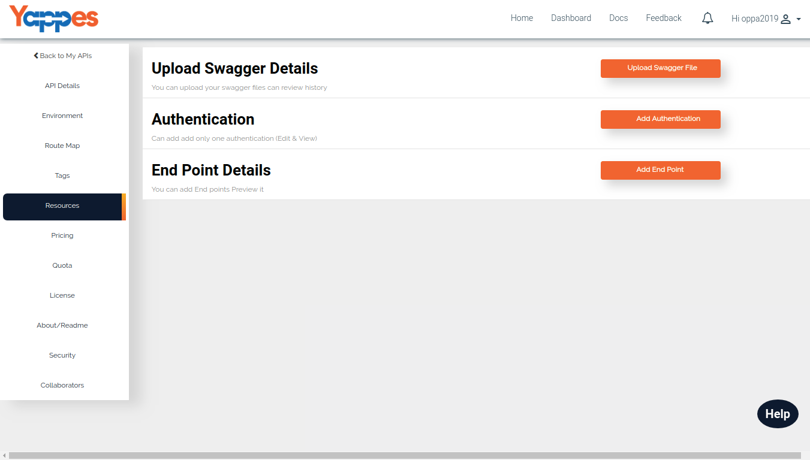

End points/Resources
====================

This is one of the important part of the API.Resources will contains the
details about Endpoints, Authentication, Preview, etc.

Once you have successfully created the API,Next step is to create the
endpoints.

Under the resource we have the following functionalities.

1.  [Manually adding an Endpoint](addendpoint)
2.  [Adding multiple Endpoint using Swagger file](addmultiplendpoint)
3.  [Add Authentication](addauth)
4.  [Preview the API Documentation](preview)

We will go through in detail in each of these section ["Next : Manually
adding end point"](addendpoint)
