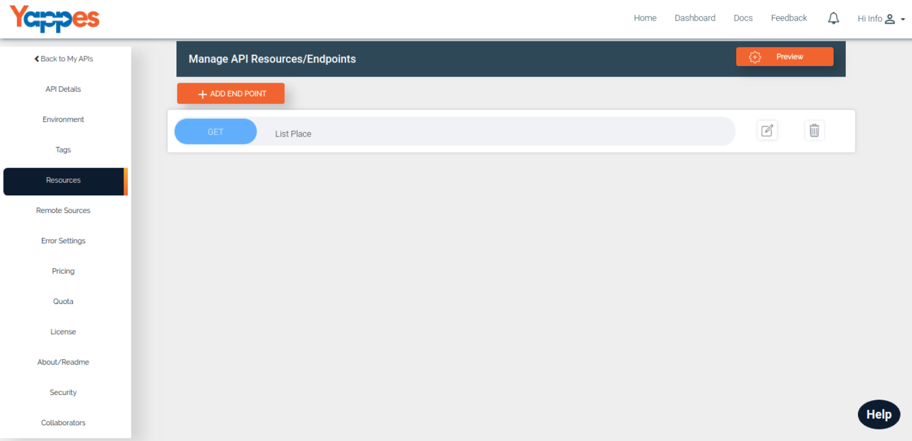

Managing Endpoints
==================

Yappes gives facility to Users to manage the Endpoints of their API's in a simple
and detailed way. 

Users can create and configure Endpoints with the
details like path, methods and content-type. 

Users can even add **Custom
Logic** for the endpoints supported with the **Custom** and **Standard
Javascript objects** for easy implementation. 

Users can also add the
documentation and test their endpoints right away.  

User can Manage Endpoints in following ways. Click on each point for details

1.  [Create New Endpoint](CreateNewAPI/create_endpoint.md)
2.  [Adding Logic](CreateNewAPI/add_logic.md)
3.  [Documentation](CreateNewAPI/endpoint_documentation.md)
4.  [Testing Endpoint](CreateNewAPI/testing_endpoint.md)

In the next section, we will see How to Create an Endpoint [**Next :
Create and Endpoint**](CreateNewAPI/create_endpoint.md)
