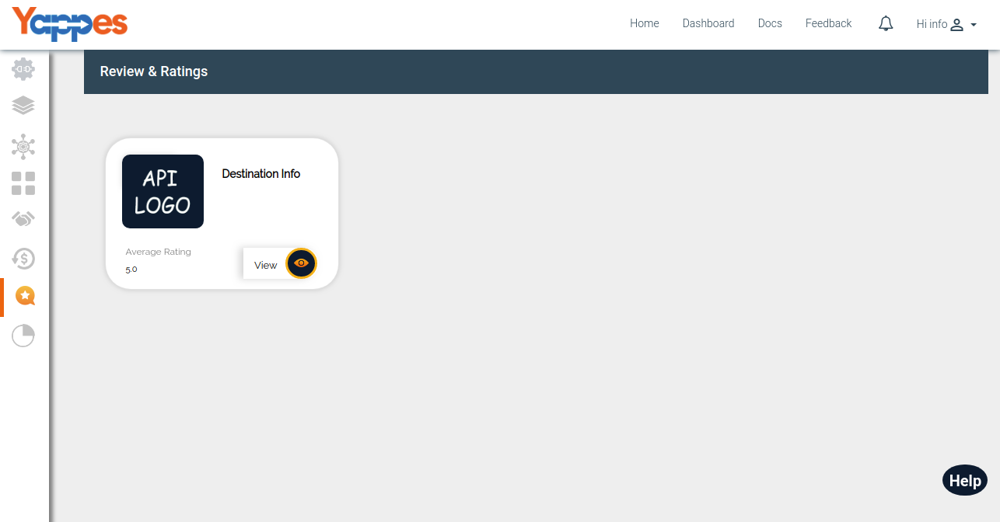
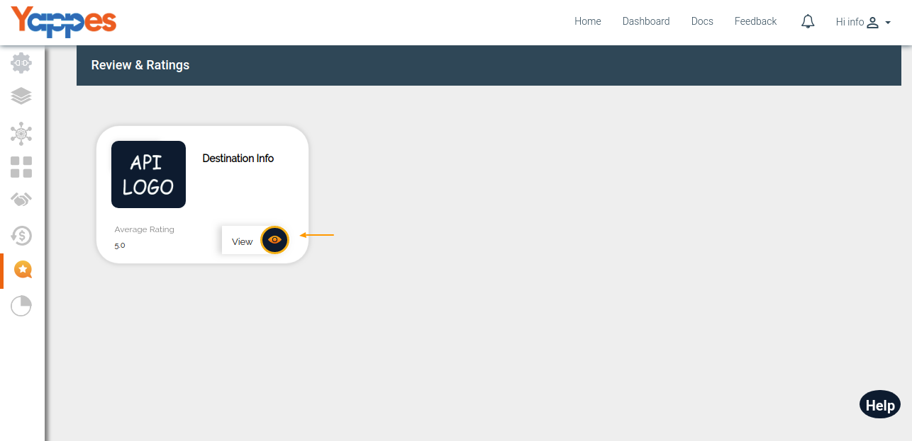
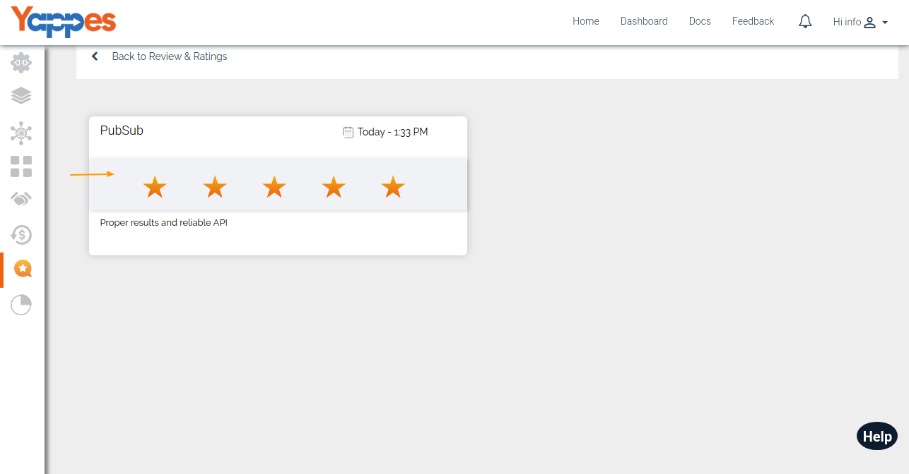

View Ratings & Review of My APIs
================================

The provider can view the ratings and reviews given by the consumers who
have subscribed their APIs.By Viewing this , Provider can monitor their quality
of API and services.

1.  To view all the reviews for an API, click on **View button**.

    

2.  All reviewsx and ratings will be listed along with consumer username,
    date and time of review submission.

    

3.  In the next section, we will see **How to View the profile of the
    user?** 
    
    [**Next : How to view the profile?**](intro_profile.md)
