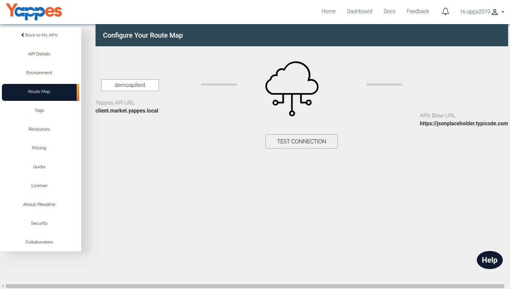

Route Map Details
=================

All the on-boarded APIs will have have their API requests routed through
Yappes Platform. Our platform will automatically take care of the
routing and you just need to test the connection between the Yappes
server and your API hostname/baseurl

1.  Yappes-Base-URL - By default it takes the API name to be part of the
    Yappes-Base-URL.  
    But you can change the name to suit your needs like your
    Company/Organization name.
2.  Once it is changed make sure that "TEST CONNECTION" button is
    clicked.
    -   Success - If Yappes platform able to connect with the Base URL,
        then it will display "Connection Successful" highlighted in
        green.
    -   Failure - If Yappes platform is not able to connect with the
        Base URL, then it will display "Connection UnSuccessful"
        highlighted in red.
3.  After this we need to categorize the APIs which we will see in
    detail ["Next : Tag Details"](tags)
